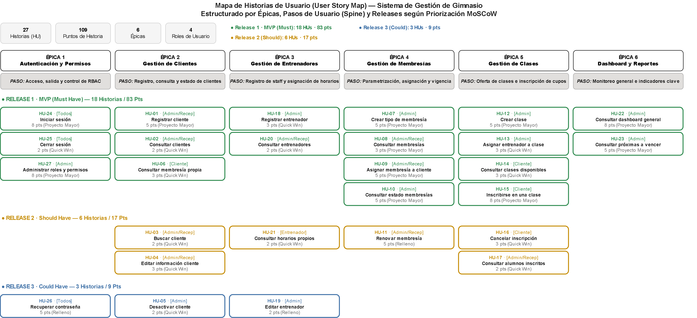

# 1. Descripción del problema

Actualmente, la gestión de un gimnasio puede realizarse de manera manual o utilizando diferentes herramientas para controlar clientes, membresías, actividades y entrenadores. Esto puede generar problemas como:

- Información de clientes desorganizada.
- Dificultad para controlar las membresías activas y vencidas.
- Dificultad para organizar las actividades, sus horarios y los espacios donde se realizan.
- Dificultad para controlar qué actividades y beneficios incluye cada plan de membresía.
- Falta de información centralizada.
- Mayor cantidad de trabajo manual para el personal administrativo.

## 1.1. Problema central

El gimnasio necesita un sistema centralizado que permita gestionar de manera eficiente clientes, membresías, actividades y entrenadores, reduciendo el trabajo manual y facilitando el acceso a la información.

# 2. Objetivo del sistema

Desarrollar un Sistema de Gestión de Gimnasio que permita administrar de manera centralizada la información de los clientes, membresías, actividades y entrenadores, facilitando las actividades administrativas y mejorando la organización del gimnasio.

## 2.1. Objetivos específicos

- Registrar y administrar clientes.
- Permitir que el administrador parametrice los tipos de membresía, las actividades que incluyen y sus beneficios, según el modelo de negocio del gimnasio.
- Administrar las actividades del gimnasio, su programación y los espacios donde se realizan.
- Gestionar entrenadores y sus horarios.
- Permitir la inscripción de clientes a las actividades incluidas en su membresía.
- Generar reportes sobre la información del gimnasio.
- Controlar el acceso a las funcionalidades según el rol y los permisos asignados.

# 3. Usuarios del sistema

El sistema tendrá principalmente cuatro tipos de usuarios:

| **Usuario** | **Función** |
| --- | --- |
| **Administrador** | Es el usuario encargado de administrar y supervisar la información general del gimnasio y de parametrizar el sistema según su modelo de negocio.  Podrá: • Administrar clientes. • Parametrizar tipos de membresía, sus actividades incluidas y sus beneficios. • Administrar membresías. • Gestionar actividades, espacios y la programación de actividades. • Gestionar entrenadores y sus horarios. • Consultar el dashboard y configurar los días de aviso de vencimiento. • Crear cuentas de usuario. • Administrar roles y configurar los permisos de cada rol. |
| **Recepcionista** | Es el usuario encargado de realizar las actividades operativas del gimnasio mediante el sistema.  Podrá, según los permisos de su rol: • Registrar y consultar clientes. • Gestionar información de membresías. • Consultar actividades programadas y sus inscritos. • Registrar y consultar entrenadores. • Definir el horario fijo de los entrenadores. • Crear las credenciales de acceso de clientes y entrenadores. |
| **Entrenador** | Es el usuario encargado de dirigir las actividades programadas que le sean asignadas.  Podrá: • Iniciar sesión. • Consultar las actividades que tiene asignadas. • Consultar sus horarios. • Consultar la información de las actividades correspondientes. |
| **Cliente** | Es el usuario que utiliza los servicios del gimnasio y que tendrá acceso al sistema mediante una cuenta personal.  Podrá: • Iniciar sesión. • Consultar su información personal. • Consultar su membresía, las actividades y beneficios que incluye y sus límites. • Consultar el estado y vencimiento de su membresía. • Consultar las actividades programadas disponibles. • Inscribirse en actividades incluidas en su membresía. • Cancelar sus inscripciones. • Consultar sus actividades inscritas. |

# 4. Épicas

## 4.1. Gestión de clientes

El sistema permitirá administrar la información de los clientes del gimnasio, facilitando su registro, consulta y actualización.

El sistema permitirá:

- Registrar nuevos clientes.
- Consultar la información de los clientes.
- Editar los datos de los clientes.
- Buscar clientes registrados.
- Desactivar clientes cuando ya no hagan parte del gimnasio, bloqueando su acceso al sistema.
- Consultar la información de la membresía asociada a cada cliente.

## 4.2. Gestión de membresías

El sistema permitirá que el administrador parametrice las membresías ofrecidas por el gimnasio según su modelo de negocio, y controlar su asignación, vigencia y renovación.

El sistema permitirá:

- Crear diferentes tipos de membresía.
- Definir el precio de cada membresía.
- Definir la duración de cada membresía y su unidad (días o meses).
- Gestionar el catálogo de beneficios del gimnasio.
- Definir las actividades que incluye cada tipo de membresía, con su límite de inscripciones y el período del límite.
- Definir los beneficios informativos que incluye cada tipo de membresía.
- Asignar una membresía a un cliente.
- Consultar las membresías activas.
- Consultar las membresías vencidas.
- Renovar membresías.
- Consultar las fechas de vencimiento.

## 4.3. Gestión de actividades

El sistema permitirá administrar las actividades ofrecidas por el gimnasio, programar cuándo, dónde y con qué entrenador se realizan, y controlar la inscripción de los clientes.

El sistema permitirá:

- Gestionar el catálogo de actividades con su capacidad máxima.
- Gestionar los espacios del gimnasio.
- Programar actividades definiendo día, horario, espacio y entrenador.
- Cambiar el entrenador de una actividad programada.
- Cancelar actividades programadas.
- Consultar actividades programadas disponibles.
- Inscribir clientes según las actividades incluidas en su membresía.
- Cancelar inscripciones.
- Consultar a los clientes inscritos.

## 4.4. Gestión de entrenadores

El sistema permitirá administrar la información de los entrenadores, sus horarios y su asignación a las actividades programadas del gimnasio.

El sistema permitirá:

- Registrar entrenadores.
- Editar información.
- Consultar entrenadores.
- Definir el horario fijo de cada entrenador.
- Asignar entrenadores a actividades programadas.
- Cambiar el estado de un entrenador, reasignando previamente sus actividades programadas.
- Consultar horarios de los entrenadores.

## 4.5. Dashboard y reportes

El sistema proporcionará al administrador un panel con información resumida sobre la operación del gimnasio.

El administrador podrá consultar:

- Cantidad de clientes activos.
- Membresías activas.
- Membresías vencidas.
- Membresías próximas para vencer, según los días de aviso que él mismo configure.
- Actividades programadas.

## 4.6. Autenticación y permisos

El sistema permitirá controlar el acceso de los usuarios y administrar los permisos de acuerdo con el rol asignado.

El sistema contará con:

- Inicio de sesión.
- Cierre de sesión.
- Recuperación de contraseña mediante el teléfono o correo registrado.
- Creación de cuentas de usuario.
- Administración de roles.
- Configuración de permisos por rol.

Los roles contemplados serán:

- Administrador.
- Recepcionista.
- Entrenador.
- Cliente.

## 4.7. User Story Map

# 5. Metodología de Priorización, Estimación y Criterios de Aceptación

Con base en la retroalimentación recibida, la priorización de las historias de usuario se realizó mediante dos técnicas reconocidas, las cuales se aplican de forma complementaria.

## 5.1. MoSCoW - Definiciones

| **Categoría** | **Significado** |
| --- | --- |
| **M — Must have** | Indispensable. Sin esta funcionalidad el sistema no cumple su propósito. Define el MVP. |
| **S — Should have** | Importante y de alto impacto, pero el sistema puede operar temporalmente sin ella. |
| **C — Could have** | Deseable. Bajo impacto si se pospone. |
| **W — Won't have (por ahora)** | Queda fuera del alcance de esta versión del proyecto. |

## 5.2. Valor vs. Esfuerzo - Definiciones

Cada historia se evalúa en dos ejes (Alto / Medio / Bajo) y se ubica en uno de los cuatro cuadrantes de la matriz:

| **Categoría** | **Descripción** | **Acción recomendada** |
| --- | --- | --- |
| **Quick win** | Alto valor, bajo esfuerzo. | Desarrollar primero. |
| **Proyecto mayor** | Alto valor, alto esfuerzo. | Planificar bien; son el núcleo del sistema. |
| **Relleno** | Bajo valor, bajo esfuerzo. | Hacer si sobra tiempo. |
| **Tarea ingrata** | Bajo valor, alto esfuerzo. | Evitar o posponer. |

Cuando el valor o el esfuerzo es **Medio**, el cuadrante se asigna con esta regla:

| **Cuadrante** | **Regla de asignación** |
| --- | --- |
| **Quick win** | Valor Alto o Medio y esfuerzo Bajo. |
| **Proyecto mayor** | Valor Alto y esfuerzo Medio o Alto. |
| **Relleno** | Valor Medio o Bajo y esfuerzo Medio, o valor Bajo y esfuerzo Bajo. |
| **Tarea ingrata** | Valor Medio o Bajo y esfuerzo Alto. |

MoSCoW define qué entra en el proyecto; Valor vs. Esfuerzo define el orden de construcción dentro de lo que ya fue aceptado.

## 5.3. Formato de criterios de aceptación (Given / When / Then)

Los criterios de aceptación se estructuran en formato **Given / When / Then** organizados en tablas por historia con escenarios principal y alternativo tomando en cuenta el más relevante:

| **Elemento** | **Significado** | **Contenido que reemplaza** |
| --- | --- | --- |
| **GIVEN (Dado que)** | Describe el contexto o estado inicial antes de que ocurra la acción. | Precondiciones que antes estaban implícitas en las viñetas. |
| **WHEN (Cuando)** | Describe la acción o evento que dispara el comportamiento a validar. | La acción principal descrita en cada viñeta (ej. "el sistema debe permitir..."). |
| **THEN (Entonces)** | Describe el resultado esperado del sistema. | El resultado o validación que antes era una viñeta separada (ej. "debe mostrar confirmación"). |

| **Fila de la tabla** | **Qué representa** |
| --- | --- |
| **Principal (éxito)** | El flujo normal de la historia con sus validaciones originales (campos obligatorios, guardado correcto y mensaje de confirmación). |
| **Alternativo (más relevante)** | Cubre la excepción o regla de negocio más crítica de la historia (como datos duplicados, falta de cupo o credenciales erróneas), manteniendo la condición de los criterios originales. |

## 5.4. Estimación en puntos de historia

Para estimar el esfuerzo de construcción de cada historia, se asignaron puntos usando una escala Fibonacci simplificada (2, 3, 5, 8) vinculada a la matriz Valor vs. Esfuerzo:

| **Esfuerzo (Valor vs. Esfuerzo)** | **Puntos de historia** | **Interpretación** |
| --- | --- | --- |
| **Bajo** | 2 – 3 | Consultas o formularios simples con poca lógica de negocio. |
| **Medio** | 5 | Incluye reglas de negocio (fechas, validaciones cruzadas) o integración modular. |
| **Alto** | 8 | Historias con múltiples módulos, agregaciones de datos o control de acceso transversal. |

# 6. Historias de usuario

## 6.1. Gestión de clientes

### 6.1.1. HU-01 Registrar cliente

Como administrador o recepcionista, quiero registrar un nuevo cliente, para almacenar su información y poder gestionarla desde el sistema.

**Dependencias:** Ninguna (sin dependencias funcionales directas).

**Criterios de aceptación:**

| **Escenario** | **GIVEN (Dado que)** | **WHEN (Cuando)** | **THEN (Entonces)** |
| --- | --- | --- | --- |
| **Principal (éxito)** | un administrador o recepcionista autenticado se encuentra en el módulo de clientes | ingresa nombre, documento y teléfono (obligatorios) y, opcionalmente, correo, y confirma el registro | el sistema guarda la información correctamente y muestra un mensaje de confirmación |
| **Alternativo (más relevante)** | ya existe un usuario registrado con el mismo número de documento | el usuario intenta registrar un nuevo cliente con ese mismo documento | el sistema rechaza el registro y muestra un mensaje indicando que el documento ya existe |

**Prioridad:**

| **MoSCoW** | **Valor** | **Esfuerzo** | **Cuadrante V/E** | **Puntos de historia** |
| --- | --- | --- | --- | --- |
| M | Alto | Medio | Proyecto mayor | 5 |

### 6.1.2. HU-02 Consultar clientes

Como administrador o recepcionista, quiero consultar los clientes registrados, para acceder fácilmente a su información.

**Dependencias:** HU-01 (Requiere que existan clientes registrados).

**Criterios de aceptación:**

| **Escenario** | **GIVEN (Dado que)** | **WHEN (Cuando)** | **THEN (Entonces)** |
| --- | --- | --- | --- |
| **Principal (éxito)** | existen clientes registrados en el sistema | un usuario autorizado accede al listado de clientes | el sistema muestra todos los clientes registrados con su información básica |
| **Alternativo (más relevante)** | no existen clientes registrados en el sistema | el usuario accede al listado de clientes | el sistema muestra un mensaje indicando que no hay clientes registrados |

**Prioridad:**

| **MoSCoW** | **Valor** | **Esfuerzo** | **Cuadrante V/E** | **Puntos de historia** |
| --- | --- | --- | --- | --- |
| M | Alto | Bajo | Quick win | 2 |

### 6.1.3. HU-03 Buscar cliente

Como administrador o recepcionista, quiero buscar un cliente por sus datos identificativos, para encontrar rápidamente su información.

**Dependencias:** HU-01 (Requiere que existan clientes registrados).

**Criterios de aceptación:**

| **Escenario** | **GIVEN (Dado que)** | **WHEN (Cuando)** | **THEN (Entonces)** |
| --- | --- | --- | --- |
| **Principal (éxito)** | existen clientes registrados | el usuario ingresa un criterio de búsqueda (nombre o documento) | el sistema muestra los clientes que coinciden con el criterio ingresado |
| **Alternativo (más relevante)** | el usuario realiza una búsqueda | ningún cliente coincide con el criterio ingresado | el sistema informa que no se encontraron resultados |

**Prioridad:**

| **MoSCoW** | **Valor** | **Esfuerzo** | **Cuadrante V/E** | **Puntos de historia** |
| --- | --- | --- | --- | --- |
| S | Medio | Bajo | Quick win | 2 |

### 6.1.4. HU-04 Editar información del cliente

Como administrador o recepcionista, quiero editar la información de un cliente, para mantener sus datos actualizados.

**Dependencias:** HU-01 (Requiere que el cliente ya esté registrado).

**Criterios de aceptación:**

| **Escenario** | **GIVEN (Dado que)** | **WHEN (Cuando)** | **THEN (Entonces)** |
| --- | --- | --- | --- |
| **Principal (éxito)** | un cliente existe en el sistema | el usuario autorizado modifica sus datos y guarda los cambios | el sistema actualiza la información y muestra una confirmación |
| **Alternativo (más relevante)** | el usuario intenta editar un cliente | el cliente ya no existe o fue desactivado previamente | el sistema informa que la edición no puede realizarse |

**Prioridad:**

| **MoSCoW** | **Valor** | **Esfuerzo** | **Cuadrante V/E** | **Puntos de historia** |
| --- | --- | --- | --- | --- |
| S | Medio | Bajo | Quick win | 3 |

### 6.1.5. HU-05 Desactivar cliente

Como administrador, quiero desactivar un cliente, para evitar que continúe apareciendo como cliente activo cuando ya no utiliza los servicios del gimnasio.

**Dependencias:** HU-01 (Requiere que el cliente exista y esté activo).

**Criterios de aceptación:**

| **Escenario** | **GIVEN (Dado que)** | **WHEN (Cuando)** | **THEN (Entonces)** |
| --- | --- | --- | --- |
| **Principal (éxito)** | un cliente se encuentra activo | el administrador confirma la desactivación | el sistema cambia el estado del cliente a inactivo, deja de mostrarlo como cliente activo y bloquea su acceso al sistema |
| **Alternativo (más relevante)** | un cliente activo tiene una membresía vigente | el administrador intenta desactivarlo | el sistema muestra una advertencia sobre la membresía vigente y permite al administrador cancelar la operación o confirmar la desactivación |

**Nota:** El administrador también puede reactivar a un cliente inactivo; al hacerlo, el cliente recupera su acceso al sistema (RF-05).

**Prioridad:**

| **MoSCoW** | **Valor** | **Esfuerzo** | **Cuadrante V/E** | **Puntos de historia** |
| --- | --- | --- | --- | --- |
| C | Medio | Bajo | Quick win | 2 |

### 6.1.6. HU-06 Consultar membresía del cliente

Como cliente, quiero consultar la información de mi membresía, para conocer el tipo de membresía que tengo, lo que incluye y su estado.

**Dependencias:** Ninguna dependencia funcional directa. El cliente debe estar autenticado para consultar su información.

**Criterios de aceptación:**

| **Escenario** | **GIVEN (Dado que)** | **WHEN (Cuando)** | **THEN (Entonces)** |
| --- | --- | --- | --- |
| **Principal (éxito)** | un cliente tiene una membresía asignada | consulta su membresía | el sistema muestra el tipo de membresía, las actividades incluidas con sus límites, los beneficios, su estado y la fecha de vencimiento |
| **Alternativo (más relevante)** | un cliente no tiene ninguna membresía asignada | consulta su membresía | el sistema muestra un mensaje indicando que no cuenta con una membresía activa |

**Prioridad:**

| **MoSCoW** | **Valor** | **Esfuerzo** | **Cuadrante V/E** | **Puntos de historia** |
| --- | --- | --- | --- | --- |
| M | Alto | Bajo | Quick win | 3 |

## 6.2. Gestión de membresías

### 6.2.1. HU-07 Crear tipo de membresía

Como administrador, quiero crear diferentes tipos de membresía, para ofrecer distintas opciones a los clientes según el modelo de negocio del gimnasio.

**Dependencias:** Ninguna (sin dependencias funcionales directas).

**Criterios de aceptación:**

| **Escenario** | **GIVEN (Dado que)** | **WHEN (Cuando)** | **THEN (Entonces)** |
| --- | --- | --- | --- |
| **Principal (éxito)** | un administrador está en el módulo de membresías | registra nombre, precio, duración y unidad de duración (días o meses) válidos | el sistema guarda el tipo de membresía correctamente |
| **Alternativo (más relevante)** | ya existe una membresía registrada con el mismo nombre | el administrador intenta crear otra membresía con ese nombre | el sistema rechaza la creación e informa del duplicado |

**Prioridad:**

| **MoSCoW** | **Valor** | **Esfuerzo** | **Cuadrante V/E** | **Puntos de historia** |
| --- | --- | --- | --- | --- |
| M | Alto | Medio | Proyecto mayor | 5 |

### 6.2.2. HU-08 Consultar membresías

Como administrador o recepcionista, quiero consultar las membresías disponibles, para conocer las opciones ofrecidas por el gimnasio.

**Dependencias:** HU-07 (Requiere que existan tipos de membresía creados).

**Criterios de aceptación:**

| **Escenario** | **GIVEN (Dado que)** | **WHEN (Cuando)** | **THEN (Entonces)** |
| --- | --- | --- | --- |
| **Principal (éxito)** | existen membresías registradas | un usuario autorizado accede al catálogo | el sistema muestra las membresías con su precio, duración, actividades incluidas con sus límites y beneficios; un tipo de membresía sin actividades o beneficios configurados se muestra igualmente, indicándolo |
| **Alternativo (más relevante)** | no existen membresías creadas en el sistema | el usuario accede al catálogo | el sistema muestra un mensaje indicando que no hay membresías disponibles |

**Prioridad:**

| **MoSCoW** | **Valor** | **Esfuerzo** | **Cuadrante V/E** | **Puntos de historia** |
| --- | --- | --- | --- | --- |
| M | Alto | Bajo | Quick win | 3 |

### 6.2.3. HU-09 Asignar membresía a cliente

Como administrador o recepcionista, quiero asignar una membresía a un cliente, para registrar el servicio contratado.

**Dependencias:** HU-01, HU-07 (Requiere que el cliente esté registrado y que existan tipos de membresía).

**Criterios de aceptación:**

| **Escenario** | **GIVEN (Dado que)** | **WHEN (Cuando)** | **THEN (Entonces)** |
| --- | --- | --- | --- |
| **Principal (éxito)** | un cliente y una membresía existen en el sistema | el usuario autorizado selecciona ambos y confirma la asignación | el sistema registra la fecha de inicio y calcula automáticamente la fecha de vencimiento según la duración y su unidad |
| **Alternativo (más relevante)** | un cliente ya tiene una membresía activa | el usuario intenta asignarle una nueva membresía | el sistema advierte del conflicto y, si el usuario confirma, registra la nueva membresía y deja la anterior en estado reemplazada |

**Prioridad:**

| **MoSCoW** | **Valor** | **Esfuerzo** | **Cuadrante V/E** | **Puntos de historia** |
| --- | --- | --- | --- | --- |
| M | Alto | Medio | Proyecto mayor | 5 |

### 6.2.4. HU-10 Consultar estado de membresías

Como administrador o recepcionista, quiero consultar las membresías activas, vencidas y próximas a vencer, para realizar un seguimiento de su estado.

**Dependencias:** HU-09, HU-35 (Requiere que existan membresías asignadas a clientes y los días de aviso configurados).

**Criterios de aceptación:**

| **Escenario** | **GIVEN (Dado que)** | **WHEN (Cuando)** | **THEN (Entonces)** |
| --- | --- | --- | --- |
| **Principal (éxito)** | existen membresías asignadas | el usuario autorizado consulta el estado de membresías | el sistema clasifica y muestra las membresías activas, vencidas y próximas a vencer (según los días de aviso configurados) con sus fechas |
| **Alternativo (más relevante)** | no existen membresías vencidas en el sistema | el usuario autorizado consulta esa categoría | el sistema muestra que no hay registros en ese estado |

**Prioridad:**

| **MoSCoW** | **Valor** | **Esfuerzo** | **Cuadrante V/E** | **Puntos de historia** |
| --- | --- | --- | --- | --- |
| M | Alto | Medio | Proyecto mayor | 5 |

### 6.2.5. HU-11 Renovar membresía

Como administrador o recepcionista, quiero renovar la membresía de un cliente, para mantener vigente su acceso a los servicios del gimnasio.

**Dependencias:** HU-09 (Requiere que el cliente cuente con una membresía previamente asignada).

**Criterios de aceptación:**

| **Escenario** | **GIVEN (Dado que)** | **WHEN (Cuando)** | **THEN (Entonces)** |
| --- | --- | --- | --- |
| **Principal (éxito)** | un cliente tiene una membresía asociada | el usuario autorizado inicia y confirma la renovación | el sistema registra una nueva membresía con vigencia desde la fecha actual, deja la anterior en estado reemplazada y muestra una confirmación |
| **Alternativo (más relevante)** | un cliente no tiene ninguna membresía asignada | el usuario intenta renovarla | el sistema informa que no existe una membresía para renovar |

**Prioridad:**

| **MoSCoW** | **Valor** | **Esfuerzo** | **Cuadrante V/E** | **Puntos de historia** |
| --- | --- | --- | --- | --- |
| S | Medio | Medio | Relleno | 5 |

### 6.2.6. HU-28 Gestionar beneficios

Como administrador, quiero gestionar el catálogo de beneficios del gimnasio, para ofrecer servicios adicionales según mi modelo de negocio.

**Nota:** Incluida en el MVP con prioridad Should have (S).

**Dependencias:** Ninguna (sin dependencias funcionales directas).

**Criterios de aceptación:**

| **Escenario** | **GIVEN (Dado que)** | **WHEN (Cuando)** | **THEN (Entonces)** |
| --- | --- | --- | --- |
| **Principal (éxito)** | un administrador está en el módulo de membresías | registra o edita un beneficio con nombre y descripción válidos, o cambia su estado (activo/inactivo) | el sistema guarda el beneficio; solo los beneficios activos quedan disponibles para asociarlos a los tipos de membresía |
| **Alternativo (más relevante)** | ya existe un beneficio con el mismo nombre | el administrador intenta registrarlo | el sistema rechaza el registro e informa del duplicado |

**Prioridad:**

| **MoSCoW** | **Valor** | **Esfuerzo** | **Cuadrante V/E** | **Puntos de historia** |
| --- | --- | --- | --- | --- |
| S | Medio | Bajo | Quick win | 2 |

### 6.2.7. HU-29 Configurar actividades y beneficios de un tipo de membresía

Como administrador, quiero definir qué actividades y beneficios incluye cada tipo de membresía, para que el sistema aplique la lógica de mi negocio a cada cliente según su plan.

**Dependencias:** HU-07, HU-30 (Requiere tipos de membresía y actividades registrados). HU-28 solo es necesaria para asociar beneficios.

**Criterios de aceptación:**

| **Escenario** | **GIVEN (Dado que)** | **WHEN (Cuando)** | **THEN (Entonces)** |
| --- | --- | --- | --- |
| **Principal (éxito)** | existen un tipo de membresía y actividades registradas (los beneficios son opcionales) | el administrador asocia actividades (con su límite de inscripciones y el período del límite, o sin límite) y, opcionalmente, beneficios al tipo de membresía | el sistema guarda la configuración y la aplica a los clientes que tienen ese tipo de membresía |
| **Alternativo (más relevante)** | el administrador define un límite para una actividad | no indica el período del límite | el sistema no guarda la configuración e indica que el período es obligatorio cuando existe un límite |

**Prioridad:**

| **MoSCoW** | **Valor** | **Esfuerzo** | **Cuadrante V/E** | **Puntos de historia** |
| --- | --- | --- | --- | --- |
| M | Alto | Medio | Proyecto mayor | 5 |

## 6.3. Gestión de actividades

### 6.3.1. HU-12 Programar actividad

Como administrador, quiero programar una actividad, para organizar cuándo, dónde y con qué entrenador se realiza.

**Dependencias:** HU-18, HU-30, HU-31, HU-33 (Requiere entrenadores con horario fijo, actividades y espacios registrados).

**Criterios de aceptación:**

| **Escenario** | **GIVEN (Dado que)** | **WHEN (Cuando)** | **THEN (Entonces)** |
| --- | --- | --- | --- |
| **Principal (éxito)** | un administrador está en el módulo de actividades | selecciona la actividad, el día, la hora de inicio y fin, el espacio y el entrenador | el sistema valida que la hora de fin sea posterior a la de inicio y que el entrenador esté activo, no tenga otra actividad en un horario superpuesto y la programación esté dentro de su horario fijo, y guarda la programación |
| **Alternativo (más relevante)** | ya existe una programación en el mismo espacio, el mismo día y con horario superpuesto | el administrador intenta guardar la nueva programación | el sistema advierte del cruce de horarios y no guarda la programación |

**Prioridad:**

| **MoSCoW** | **Valor** | **Esfuerzo** | **Cuadrante V/E** | **Puntos de historia** |
| --- | --- | --- | --- | --- |
| M | Alto | Medio | Proyecto mayor | 5 |

### 6.3.2. HU-13 Cambiar el entrenador de una actividad programada

Como administrador, quiero asignar o cambiar el entrenador de una actividad programada, para organizar quién estará encargado de dirigirla.

**Dependencias:** HU-12, HU-18, HU-33 (Requiere que la programación exista y que el entrenador esté registrado con su horario fijo).

**Criterios de aceptación:**

| **Escenario** | **GIVEN (Dado que)** | **WHEN (Cuando)** | **THEN (Entonces)** |
| --- | --- | --- | --- |
| **Principal (éxito)** | una actividad programada y un entrenador activo existen en el sistema | el administrador selecciona el entrenador y confirma la asignación | el sistema registra la asignación correctamente |
| **Alternativo (más relevante)** | el entrenador tiene otra actividad programada en el mismo horario o el horario está fuera de su horario fijo | el administrador intenta asignarlo | el sistema advierte del conflicto de horario y no realiza la asignación |

**Nota:** Solo pueden asignarse entrenadores activos; si el entrenador seleccionado está inactivo, el sistema rechaza la asignación (RN-15).

**Prioridad:**

| **MoSCoW** | **Valor** | **Esfuerzo** | **Cuadrante V/E** | **Puntos de historia** |
| --- | --- | --- | --- | --- |
| M | Alto | Bajo | Quick win | 3 |

### 6.3.3. HU-14 Consultar actividades programadas disponibles

Como cliente, quiero consultar las actividades programadas disponibles, para conocer las actividades a las que me puedo inscribir.

El administrador y el recepcionista también pueden consultar este listado (RF-14), sin la validación de membresía.

**Dependencias:** HU-12 (Requiere que existan actividades programadas).

**Criterios de aceptación:**

| **Escenario** | **GIVEN (Dado que)** | **WHEN (Cuando)** | **THEN (Entonces)** |
| --- | --- | --- | --- |
| **Principal (éxito)** | existen actividades programadas no canceladas | el cliente consulta las actividades disponibles | el sistema muestra la actividad, el día, el horario, el espacio, el cupo disponible y el entrenador asignado; indica si la actividad está incluida en su membresía (si no lo está, informa que no puede inscribirse con su plan actual) y, si tiene límite, cuántas inscripciones le quedan |
| **Alternativo (más relevante)** | no existen actividades programadas con cupo disponible | el cliente consulta el listado | el sistema indica que no hay actividades disponibles en ese momento |

**Prioridad:**

| **MoSCoW** | **Valor** | **Esfuerzo** | **Cuadrante V/E** | **Puntos de historia** |
| --- | --- | --- | --- | --- |
| M | Alto | Bajo | Quick win | 3 |

### 6.3.4. HU-15 Inscribirse en una actividad

Como cliente, quiero inscribirme en una actividad programada, para participar en las actividades incluidas en mi membresía.

**Dependencias:** HU-14, HU-09, HU-29 (Requiere consultar actividades disponibles, contar con una membresía activa y que su tipo de membresía tenga actividades configuradas).

**Criterios de aceptación:**

| **Escenario** | **GIVEN (Dado que)** | **WHEN (Cuando)** | **THEN (Entonces)** |
| --- | --- | --- | --- |
| **Principal (éxito)** | la actividad programada tiene cupo disponible, el cliente cuenta con una membresía activa que incluye esa actividad, no ha alcanzado su límite (si existe) y no tiene una inscripción activa en esa programación | el cliente se inscribe en la actividad | el sistema registra la inscripción, informa el éxito de la operación y, cuando la actividad tiene límite, muestra cuántas inscripciones le quedan en el período |
| **Alternativo (más relevante)** | el cliente alcanzó el límite de inscripciones de esa actividad definido en su membresía | el cliente intenta inscribirse | el sistema rechaza la inscripción e informa su límite según su plan |

**Prioridad:**

| **MoSCoW** | **Valor** | **Esfuerzo** | **Cuadrante V/E** | **Puntos de historia** |
| --- | --- | --- | --- | --- |
| M | Alto | Alto | Proyecto mayor | 8 |

### 6.3.5. HU-16 Cancelar inscripción

Como cliente, quiero cancelar mi inscripción en una actividad, para liberar el cupo cuando no pueda participar.

**Dependencias:** HU-15, HU-38 (Requiere que el cliente tenga una inscripción previa y pueda consultar sus inscripciones).

**Criterios de aceptación:**

| **Escenario** | **GIVEN (Dado que)** | **WHEN (Cuando)** | **THEN (Entonces)** |
| --- | --- | --- | --- |
| **Principal (éxito)** | el cliente tiene una inscripción activa | confirma la cancelación | el sistema cancela la inscripción, libera el cupo correspondiente y deja de contarla para el límite de su plan |
| **Alternativo (más relevante)** | el cliente no tiene una inscripción activa en la actividad | intenta cancelar la inscripción | el sistema informa que no existe una inscripción activa para cancelar |

**Prioridad:**

| **MoSCoW** | **Valor** | **Esfuerzo** | **Cuadrante V/E** | **Puntos de historia** |
| --- | --- | --- | --- | --- |
| S | Medio | Bajo | Quick win | 3 |

### 6.3.6. HU-17 Consultar clientes inscritos

Como administrador o recepcionista, quiero consultar a los clientes inscritos en una actividad programada, para conocer la cantidad de participantes.

**Dependencias:** HU-15 (Requiere que existan inscripciones registradas).

**Criterios de aceptación:**

| **Escenario** | **GIVEN (Dado que)** | **WHEN (Cuando)** | **THEN (Entonces)** |
| --- | --- | --- | --- |
| **Principal (éxito)** | una actividad programada tiene clientes inscritos | el usuario autorizado la consulta | el sistema muestra la lista de inscritos y la cantidad total |
| **Alternativo (más relevante)** | una actividad programada no tiene inscripciones registradas | el usuario la consulta | el sistema indica que no hay clientes inscritos en esa actividad |

**Prioridad:**

| **MoSCoW** | **Valor** | **Esfuerzo** | **Cuadrante V/E** | **Puntos de historia** |
| --- | --- | --- | --- | --- |
| S | Medio | Bajo | Quick win | 2 |

### 6.3.7. HU-30 Gestionar actividades

Como administrador, quiero gestionar el catálogo de actividades del gimnasio, para definir qué actividades se ofrecen y su capacidad máxima.

**Dependencias:** Ninguna (sin dependencias funcionales directas).

**Criterios de aceptación:**

| **Escenario** | **GIVEN (Dado que)** | **WHEN (Cuando)** | **THEN (Entonces)** |
| --- | --- | --- | --- |
| **Principal (éxito)** | un administrador está en el módulo de actividades | registra o edita una actividad con nombre, descripción y capacidad máxima válidos, o cambia su estado (activo/inactivo) | el sistema guarda la actividad; solo las actividades activas quedan disponibles para programarlas y asociarlas a los tipos de membresía |
| **Alternativo (más relevante)** | el administrador está registrando una actividad | deja campos obligatorios vacíos o ingresa una capacidad máxima no válida | el sistema muestra un error y no guarda la actividad |

**Prioridad:**

| **MoSCoW** | **Valor** | **Esfuerzo** | **Cuadrante V/E** | **Puntos de historia** |
| --- | --- | --- | --- | --- |
| M | Alto | Bajo | Quick win | 3 |

### 6.3.8. HU-31 Gestionar espacios

Como administrador, quiero gestionar los espacios del gimnasio, para programar las actividades en el lugar adecuado y evitar cruces.

**Dependencias:** Ninguna (sin dependencias funcionales directas).

**Criterios de aceptación:**

| **Escenario** | **GIVEN (Dado que)** | **WHEN (Cuando)** | **THEN (Entonces)** |
| --- | --- | --- | --- |
| **Principal (éxito)** | un administrador está en el módulo de actividades | registra o edita un espacio con nombre y capacidad válidos | el sistema guarda el espacio y lo deja disponible para programar actividades |
| **Alternativo (más relevante)** | el administrador está registrando un espacio | deja campos obligatorios vacíos | el sistema muestra un error y no guarda el espacio |

**Prioridad:**

| **MoSCoW** | **Valor** | **Esfuerzo** | **Cuadrante V/E** | **Puntos de historia** |
| --- | --- | --- | --- | --- |
| M | Alto | Bajo | Quick win | 2 |

### 6.3.9. HU-32 Cancelar actividad programada

Como administrador, quiero cancelar una actividad programada, para que no reciba más inscripciones cuando no pueda realizarse.

**Dependencias:** HU-12 (Requiere que la actividad esté programada).

**Criterios de aceptación:**

| **Escenario** | **GIVEN (Dado que)** | **WHEN (Cuando)** | **THEN (Entonces)** |
| --- | --- | --- | --- |
| **Principal (éxito)** | una actividad programada tiene clientes inscritos | el administrador confirma su cancelación | el sistema cambia su estado a cancelada y cancela todas sus inscripciones activas |
| **Alternativo (más relevante)** | la actividad programada ya está cancelada | el administrador intenta cancelarla de nuevo | el sistema informa que la actividad ya se encuentra cancelada |

**Prioridad:**

| **MoSCoW** | **Valor** | **Esfuerzo** | **Cuadrante V/E** | **Puntos de historia** |
| --- | --- | --- | --- | --- |
| C | Medio | Medio | Relleno | 5 |

### 6.3.10. HU-38 Consultar mis inscripciones

Como cliente, quiero consultar las actividades programadas en las que estoy inscrito, para organizar mi asistencia y poder cancelar una inscripción si lo necesito.

**Dependencias:** HU-15 (Requiere que el cliente tenga inscripciones registradas).

**Criterios de aceptación:**

| **Escenario** | **GIVEN (Dado que)** | **WHEN (Cuando)** | **THEN (Entonces)** |
| --- | --- | --- | --- |
| **Principal (éxito)** | un cliente autenticado tiene inscripciones registradas | consulta sus inscripciones | el sistema muestra las actividades programadas en las que está inscrito con el día, el horario, el espacio y el estado de cada inscripción |
| **Alternativo (más relevante)** | un cliente autenticado no tiene inscripciones activas | consulta sus inscripciones | el sistema indica que no tiene inscripciones activas |

**Prioridad:**

| **MoSCoW** | **Valor** | **Esfuerzo** | **Cuadrante V/E** | **Puntos de historia** |
| --- | --- | --- | --- | --- |
| S | Medio | Bajo | Quick win | 2 |

## 6.4. Gestión de entrenadores

### 6.4.1. HU-18 Registrar entrenador

Como administrador o recepcionista, quiero registrar entrenadores, para mantener organizada la información del personal encargado de las actividades.

**Dependencias:** Ninguna (sin dependencias funcionales directas).

**Criterios de aceptación:**

| **Escenario** | **GIVEN (Dado que)** | **WHEN (Cuando)** | **THEN (Entonces)** |
| --- | --- | --- | --- |
| **Principal (éxito)** | un administrador o recepcionista está registrando un entrenador | ingresa nombre, documento y teléfono (obligatorios) y, opcionalmente, correo | el sistema guarda el registro correctamente |
| **Alternativo (más relevante)** | ya existe un usuario registrado con el mismo número de documento | el usuario intenta registrar el entrenador con ese documento | el sistema rechaza el registro e informa que el documento ya existe |

**Prioridad:**

| **MoSCoW** | **Valor** | **Esfuerzo** | **Cuadrante V/E** | **Puntos de historia** |
| --- | --- | --- | --- | --- |
| M | Alto | Bajo | Quick win | 3 |

### 6.4.2. HU-19 Editar información del entrenador

Como administrador, quiero editar la información de un entrenador, para mantener sus datos actualizados.

**Dependencias:** HU-18 (Requiere que el entrenador ya esté registrado)

**Criterios de aceptación:**

| **Escenario** | **GIVEN (Dado que)** | **WHEN (Cuando)** | **THEN (Entonces)** |
| --- | --- | --- | --- |
| **Principal (éxito)** | un entrenador existe en el sistema | el administrador modifica su información y guarda | el sistema actualiza los datos correctamente |
| **Alternativo (más relevante)** | el administrador está editando un entrenador | ingresa datos con formato inválido | el sistema muestra un error y no guarda los cambios |

**Prioridad:**

| **MoSCoW** | **Valor** | **Esfuerzo** | **Cuadrante V/E** | **Puntos de historia** |
| --- | --- | --- | --- | --- |
| C | Bajo | Bajo | Relleno | 2 |

### 6.4.3. HU-20 Consultar entrenadores

Como administrador o recepcionista, quiero consultar a los entrenadores registrados, para conocer la información del personal disponible.

**Dependencias:** HU-18 (Requiere que existan entrenadores registrados).

**Criterios de aceptación:**

| **Escenario** | **GIVEN (Dado que)** | **WHEN (Cuando)** | **THEN (Entonces)** |
| --- | --- | --- | --- |
| **Principal (éxito)** | existen entrenadores registrados | el usuario autorizado consulta el listado | el sistema muestra los entrenadores con su información |
| **Alternativo (más relevante)** | no existen entrenadores en el sistema | el usuario accede al listado | el sistema indica que no hay entrenadores registrados |

**Prioridad:**

| **MoSCoW** | **Valor** | **Esfuerzo** | **Cuadrante V/E** | **Puntos de historia** |
| --- | --- | --- | --- | --- |
| M | Alto | Bajo | Quick win | 2 |

### 6.4.4. HU-21 Consultar horarios del entrenador

Como entrenador, quiero consultar mis horarios, para conocer las actividades programadas que tengo asignadas.

**Dependencias:** HU-12 (Requiere que existan actividades programadas asignadas al entrenador).

**Criterios de aceptación:**

| **Escenario** | **GIVEN (Dado que)** | **WHEN (Cuando)** | **THEN (Entonces)** |
| --- | --- | --- | --- |
| **Principal (éxito)** | el entrenador tiene actividades programadas asignadas | consulta sus horarios | el sistema muestra las actividades, los días, los horarios y los espacios correspondientes |
| **Alternativo (más relevante)** | el entrenador no tiene actividades programadas asignadas | consulta sus horarios | el sistema indica que no tiene actividades asignadas actualmente |

**Prioridad:**

| **MoSCoW** | **Valor** | **Esfuerzo** | **Cuadrante V/E** | **Puntos de historia** |
| --- | --- | --- | --- | --- |
| S | Medio | Bajo | Quick win | 2 |

### 6.4.5. HU-33 Definir horario fijo del entrenador

Como administrador o recepcionista, quiero definir el horario fijo de cada entrenador, para asignarle actividades únicamente dentro de su horario.

**Dependencias:** HU-18 (Requiere que el entrenador esté registrado).

**Criterios de aceptación:**

| **Escenario** | **GIVEN (Dado que)** | **WHEN (Cuando)** | **THEN (Entonces)** |
| --- | --- | --- | --- |
| **Principal (éxito)** | un entrenador está registrado en el sistema | el usuario autorizado registra los días y las horas de inicio y fin de su horario | el sistema guarda el horario fijo del entrenador |
| **Alternativo (más relevante)** | el usuario está registrando un horario | ingresa una hora de fin anterior o igual a la hora de inicio | el sistema muestra un error y no guarda el horario |

**Prioridad:**

| **MoSCoW** | **Valor** | **Esfuerzo** | **Cuadrante V/E** | **Puntos de historia** |
| --- | --- | --- | --- | --- |
| M | Alto | Bajo | Quick win | 3 |

### 6.4.6. HU-34 Cambiar estado del entrenador

Como administrador, quiero cambiar el estado de un entrenador, para retirarlo de la operación sin dejar actividades programadas sin entrenador.

**Dependencias:** HU-18, HU-13 (Requiere que el entrenador esté registrado y que sus actividades programadas puedan reasignarse).

**Criterios de aceptación:**

| **Escenario** | **GIVEN (Dado que)** | **WHEN (Cuando)** | **THEN (Entonces)** |
| --- | --- | --- | --- |
| **Principal (éxito)** | un entrenador activo no tiene actividades programadas asignadas | el administrador confirma su desactivación | el sistema cambia su estado a inactivo y bloquea su acceso al sistema |
| **Alternativo (más relevante)** | el entrenador tiene actividades programadas asignadas | el administrador intenta desactivarlo | el sistema informa que primero debe reasignar sus actividades programadas a otro entrenador |

**Nota:** El administrador también puede reactivar a un entrenador inactivo; al hacerlo, recupera su acceso al sistema. La reactivación no le asigna actividades: cualquier programación posterior debe cumplir las validaciones de horario fijo y de cruces (RN-16, RN-24).

**Prioridad:**

| **MoSCoW** | **Valor** | **Esfuerzo** | **Cuadrante V/E** | **Puntos de historia** |
| --- | --- | --- | --- | --- |
| C | Medio | Medio | Relleno | 5 |

## 6.5. Dashboard y reportes

### 6.5.1. HU-22 Consultar dashboard

Como administrador, quiero consultar un dashboard con información general del gimnasio, para conocer rápidamente el estado de la operación.

**Dependencias:** HU-01, HU-09, HU-10, HU-12 (Requiere datos de clientes, membresías y actividades programadas para consolidar la información).

**Criterios de aceptación:**

| **Escenario** | **GIVEN (Dado que)** | **WHEN (Cuando)** | **THEN (Entonces)** |
| --- | --- | --- | --- |
| **Principal (éxito)** | existe información registrada de clientes, membresías y actividades programadas | el administrador accede al dashboard | el sistema muestra el resumen de clientes activos, membresías activas/vencidas/próximas a vencer y actividades programadas |
| **Alternativo (más relevante)** | el sistema aún no tiene información suficiente en alguna categoría | el administrador consulta el dashboard | el sistema muestra el valor en cero o un mensaje de ausencia de datos para esa categoría, sin generar error |

**Prioridad:**

| **MoSCoW** | **Valor** | **Esfuerzo** | **Cuadrante V/E** | **Puntos de historia** |
| --- | --- | --- | --- | --- |
| M | Alto | Alto | Proyecto mayor | 8 |

### 6.5.2. HU-23 Consultar membresías próximas a vencer

Como administrador o recepcionista, quiero consultar las membresías próximas a vencer, para realizar un seguimiento de los clientes que deben renovar.

**Dependencias:** HU-09, HU-10, HU-35 (Requiere membresías asignadas, su clasificación por estado y los días de aviso configurados).

**Criterios de aceptación:**

| **Escenario** | **GIVEN (Dado que)** | **WHEN (Cuando)** | **THEN (Entonces)** |
| --- | --- | --- | --- |
| **Principal (éxito)** | existen membresías que vencen dentro de los días de aviso configurados | el usuario autorizado las consulta | el sistema muestra el cliente asociado y la fecha de vencimiento |
| **Alternativo (más relevante)** | ninguna membresía está próxima a vencer | el usuario autorizado realiza la consulta | el sistema indica que no hay membresías en ese estado |

**Prioridad:**

| **MoSCoW** | **Valor** | **Esfuerzo** | **Cuadrante V/E** | **Puntos de historia** |
| --- | --- | --- | --- | --- |
| M | Alto | Medio | Proyecto mayor | 5 |

### 6.5.3. HU-35 Configurar días de aviso de vencimiento

Como administrador, quiero configurar con cuántos días de anticipación una membresía se considera próxima a vencer, para ajustar el seguimiento a la lógica de mi negocio.

**Dependencias:** Ninguna (sin dependencias funcionales directas).

**Criterios de aceptación:**

| **Escenario** | **GIVEN (Dado que)** | **WHEN (Cuando)** | **THEN (Entonces)** |
| --- | --- | --- | --- |
| **Principal (éxito)** | un administrador está en la configuración del sistema | ingresa un número de días de aviso válido y guarda | el sistema guarda el valor y lo aplica a la clasificación de membresías próximas a vencer en todo el gimnasio |
| **Alternativo (más relevante)** | el administrador está configurando los días de aviso | ingresa un valor vacío, no numérico o menor que 1 | el sistema muestra un error y conserva el valor anterior |

**Nota:** El valor mínimo es 1 día; el valor cero se rechaza.

**Prioridad:**

| **MoSCoW** | **Valor** | **Esfuerzo** | **Cuadrante V/E** | **Puntos de historia** |
| --- | --- | --- | --- | --- |
| S | Medio | Bajo | Quick win | 2 |

## 6.6. Autenticación y permisos

### 6.6.1. HU-24 Iniciar sesión

Como usuario del sistema, quiero iniciar sesión con mis credenciales, para acceder a las funcionalidades correspondientes a mi rol.

**Dependencias:** Ninguna (sin dependencias funcionales directas; historia fundacional; no depende de otras, pero es prerrequisito transversal de todas las demás).

**Criterios de aceptación:**

| **Escenario** | **GIVEN (Dado que)** | **WHEN (Cuando)** | **THEN (Entonces)** |
| --- | --- | --- | --- |
| **Principal (éxito)** | un usuario registrado y activo cuenta con credenciales válidas | ingresa un usuario y contraseña correctos | el sistema permite el acceso y muestra únicamente las funcionalidades permitidas para su rol |
| **Alternativo (más relevante)** | un usuario intenta iniciar sesión | ingresa un usuario o contraseña incorrectos | el sistema muestra un mensaje de error y no permite el acceso |

**Prioridad:**

| **MoSCoW** | **Valor** | **Esfuerzo** | **Cuadrante V/E** | **Puntos de historia** |
| --- | --- | --- | --- | --- |
| M | Alto | Alto | Proyecto mayor | 8 |

### 6.6.2. HU-25 Cerrar sesión

Como usuario del sistema, quiero cerrar sesión, para proteger mi cuenta cuando termine de utilizar el sistema.

**Dependencias:** HU-24 (Requiere una sesión iniciada previamente).

**Criterios de aceptación:**

| **Escenario** | **GIVEN (Dado que)** | **WHEN (Cuando)** | **THEN (Entonces)** |
| --- | --- | --- | --- |
| **Principal (éxito)** | un usuario tiene una sesión activa | selecciona cerrar sesión | el sistema finaliza la sesión y redirige a la pantalla de inicio de sesión |
| **Alternativo (más relevante)** | un usuario cerró sesión previamente | intenta acceder nuevamente a una funcionalidad protegida | el sistema le solicita autenticarse antes de continuar |

**Prioridad:**

| **MoSCoW** | **Valor** | **Esfuerzo** | **Cuadrante V/E** | **Puntos de historia** |
| --- | --- | --- | --- | --- |
| M | Alto | Bajo | Quick win | 2 |

### 6.6.3. HU-26 Recuperar contraseña

Como usuario del sistema, quiero recuperar mi contraseña, para poder volver a acceder a mi cuenta cuando la haya olvidado.

**Dependencias:** Ninguna dependencia funcional directa. El usuario debe tener una cuenta registrada para iniciar el proceso de recuperación.

**Criterios de aceptación:**

| **Escenario** | **GIVEN (Dado que)** | **WHEN (Cuando)** | **THEN (Entonces)** |
| --- | --- | --- | --- |
| **Principal (éxito)** | un usuario registrado olvidó su contraseña y solicita recuperarla | el sistema le envía un código de un solo uso a su teléfono o correo registrado y el usuario lo ingresa correctamente antes de que venza | el sistema le permite establecer una nueva contraseña |
| **Alternativo (más relevante)** | el usuario recibió un código de recuperación | el código vence o el usuario agota los tres intentos fallidos | el sistema invalida el código e indica que debe solicitar uno nuevo |

**Nota:** El flujo es: (1) el usuario solicita recuperar su contraseña; (2) el sistema envía un código de un solo uso al teléfono o correo registrado; (3) el usuario lo ingresa antes de que venza (15 minutos), con máximo 3 intentos fallidos; (4) si el código es válido, establece una nueva contraseña; (5) si vence o se agotan los intentos, el código queda invalidado y debe solicitarse otro. Si los datos ingresados no corresponden a una cuenta registrada, el sistema informa que no fue posible verificar la identidad. El código no se almacena en la base de datos (RN-53, RES-12).

**Prioridad:**

| **MoSCoW** | **Valor** | **Esfuerzo** | **Cuadrante V/E** | **Puntos de historia** |
| --- | --- | --- | --- | --- |
| C | Medio | Medio | Relleno | 5 |

### 6.6.4. HU-27 Administrar roles y permisos

Como administrador, quiero asignar roles a los usuarios y configurar los permisos de cada rol, para controlar el acceso a las funcionalidades del sistema.

**Dependencias:** HU-24 (Requiere el módulo de autenticación para aplicar los permisos al iniciar sesión).

**Criterios de aceptación:**

| **Escenario** | **GIVEN (Dado que)** | **WHEN (Cuando)** | **THEN (Entonces)** |
| --- | --- | --- | --- |
| **Principal (éxito)** | un administrador consulta los roles disponibles | asigna un rol a un usuario o modifica los permisos de un rol | el sistema actualiza el acceso de los usuarios según los permisos de su rol |
| **Alternativo (más relevante)** | un usuario tiene el rol de cliente | intenta acceder a una funcionalidad reservada a otro rol | el sistema deniega el acceso y muestra un mensaje correspondiente |

**Prioridad:**

| **MoSCoW** | **Valor** | **Esfuerzo** | **Cuadrante V/E** | **Puntos de historia** |
| --- | --- | --- | --- | --- |
| M | Alto | Alto | Proyecto mayor | 8 |

### 6.6.5. HU-36 Crear credenciales de acceso

Como administrador o recepcionista, quiero crear las credenciales de acceso de clientes y entrenadores, para que puedan ingresar al sistema.

**Dependencias:** HU-01, HU-18 (Requiere que el cliente o el entrenador estén registrados).

**Criterios de aceptación:**

| **Escenario** | **GIVEN (Dado que)** | **WHEN (Cuando)** | **THEN (Entonces)** |
| --- | --- | --- | --- |
| **Principal (éxito)** | un cliente o entrenador está registrado y no tiene credenciales | el usuario autorizado asigna un nombre de usuario y una contraseña | el sistema guarda las credenciales de forma segura y la persona puede iniciar sesión con su rol |
| **Alternativo (más relevante)** | el nombre de usuario ingresado ya pertenece a otra cuenta | el usuario autorizado intenta guardar las credenciales | el sistema rechaza el registro e informa que el nombre de usuario no está disponible |

**Prioridad:**

| **MoSCoW** | **Valor** | **Esfuerzo** | **Cuadrante V/E** | **Puntos de historia** |
| --- | --- | --- | --- | --- |
| M | Alto | Medio | Proyecto mayor | 5 |

### 6.6.6. HU-37 Registrar usuarios administrativos

Como administrador, quiero registrar administradores y recepcionistas con sus datos y credenciales, para gestionar el equipo de trabajo que opera el sistema.

**Dependencias:** HU-24, HU-27 (Requiere el módulo de autenticación y los roles definidos). La primera cuenta de administrador se crea mediante la configuración inicial del sistema (RES-11); a partir de ella se registran los demás administradores y recepcionistas con esta historia.

**Criterios de aceptación:**

| **Escenario** | **GIVEN (Dado que)** | **WHEN (Cuando)** | **THEN (Entonces)** |
| --- | --- | --- | --- |
| **Principal (éxito)** | un administrador está en el módulo de usuarios | ingresa nombre, documento, teléfono, correo opcional, rol (Administrador o Recepcionista) y credenciales | el sistema guarda el usuario y le permite iniciar sesión con los permisos de su rol |
| **Alternativo (más relevante)** | ya existe un usuario con el mismo número de documento | el administrador intenta registrarlo | el sistema rechaza el registro e informa que el documento ya existe |

**Prioridad:**

| **MoSCoW** | **Valor** | **Esfuerzo** | **Cuadrante V/E** | **Puntos de historia** |
| --- | --- | --- | --- | --- |
| M | Alto | Medio | Proyecto mayor | 5 |

# 7. Alcance del MVP

| **Épica** | **Funcionalidades incluidas en el MVP** |
| --- | --- |
| **Gestión de clientes** | Registrar clientes · Consultar clientes · Buscar clientes · Editar información · Consultar membresía asociada |
| **Gestión de membresías** | Crear tipos de membresía · Gestionar beneficios · Configurar actividades y beneficios de cada tipo · Consultar membresías · Asignar membresía a clientes · Consultar estado · Consultar fechas de vencimiento |
| **Gestión de actividades** | Gestionar actividades · Gestionar espacios · Programar actividades · Asignar entrenadores · Consultar actividades disponibles · Permitir a los clientes inscribirse según su membresía |
| **Gestión de entrenadores** | Registrar entrenadores · Consultar entrenadores · Definir horario fijo · Asignar entrenadores a actividades programadas |
| **Dashboard y reportes** | Consultar clientes activos · Consultar membresías activas y vencidas · Consultar actividades programadas · Consultar membresías próximas a vencer · Configurar días de aviso |
| **Autenticación y permisos** | Iniciar sesión · Cerrar sesión · Registrar usuarios administrativos · Crear credenciales de acceso · Administrar roles y permisos · Controlar acceso según el rol del usuario |
