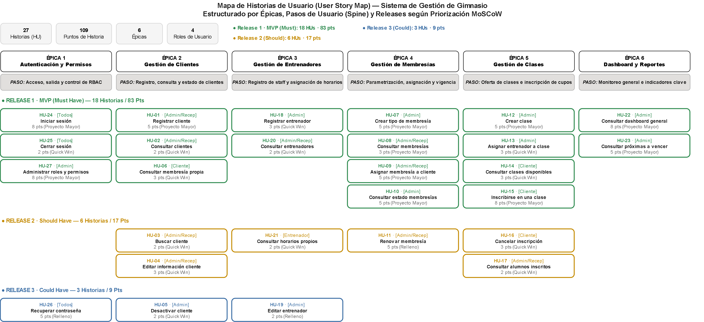

# 1. Descripción del problema

Actualmente, la gestión de un gimnasio puede realizarse de manera manual o utilizando diferentes herramientas para controlar clientes, membresías, clases y entrenadores. Esto puede generar problemas como:

- Información de clientes desorganizada.
- Dificultad para controlar las membresías activas y vencidas.
- Dificultad para organizar las clases y horarios.
- Falta de información centralizada.
- Mayor cantidad de trabajo manual para el personal administrativo.

## 1.1. Problema central

El gimnasio necesita un sistema centralizado que permita gestionar de manera eficiente clientes, membresías, clases y entrenadores, reduciendo el trabajo manual y facilitando el acceso a la información.

# 2. Objetivo del sistema

Desarrollar un Sistema de Gestión de Gimnasio que permita administrar de manera centralizada la información de los clientes, membresías, clases y entrenadores, facilitando las actividades administrativas y mejorando la organización del gimnasio.

## 2.1. Objetivos específicos

- Registrar y administrar clientes.
- Gestionar los diferentes tipos de membresías.
- Administrar las clases y sus horarios.
- Gestionar entrenadores.
- Permitir la inscripción de clientes a clases.
- Generar reportes sobre la información del gimnasio.
- Proporcionar diferentes permisos dependiendo del tipo de usuario.

# 3. Usuarios del sistema

El sistema tendrá principalmente cuatro tipos de usuarios:

| **Usuario** | **Función** |
| --- | --- |
| **Administrador** | Es el usuario encargado de administrar y supervisar la información general del gimnasio.  Podrá: • Administrar clientes. • Administrar membresías. • Gestionar clases. • Gestionar entrenadores. • Consultar el dashboard. • Administrar roles y permisos. |
| **Recepcionista** | Es el usuario encargado de realizar las actividades operativas del gimnasio mediante el sistema.  Podrá: • Registrar y consultar clientes. • Gestionar información de membresías según sus permisos. • Consultar y gestionar clases según sus permisos. • Consultar información de entrenadores. |
| **Entrenador** | Es el usuario encargado de dirigir las clases que le sean asignadas.  Podrá: • Iniciar sesión. • Consultar las clases que tiene asignadas. • Consultar sus horarios. • Consultar la información de las clases correspondientes. |
| **Cliente** | Es el usuario que utiliza los servicios del gimnasio y que tendrá acceso al sistema mediante una cuenta personal.  Podrá: • Iniciar sesión. • Consultar su información personal. • Consultar su membresía. • Consultar el estado y vencimiento de su membresía. • Consultar las clases disponibles. • Inscribirse en clases. • Cancelar sus inscripciones. • Consultar sus clases inscritas. |

# 4. Épicas

## 4.1. Gestión de clientes

El sistema permitirá administrar la información de los clientes del gimnasio, facilitando su registro, consulta y actualización.

El sistema permitirá:

- Registrar nuevos clientes.
- Consultar la información de los clientes.
- Editar los datos de los clientes.
- Buscar clientes registrados.
- Desactivar clientes cuando ya no hagan parte del gimnasio.
- Consultar la información de la membresía asociada a cada cliente.

## 4.2. Gestión de membresías

El sistema permitirá administrar las diferentes membresías ofrecidas por el gimnasio y controlar su asignación, vigencia y renovación.

El sistema permitirá:

- Crear diferentes tipos de membresía.
- Definir el precio de cada membresía.
- Definir la duración de cada membresía.
- Asignar una membresía a un cliente.
- Consultar las membresías activas.
- Consultar las membresías vencidas.
- Renovar membresías.
- Consultar las fechas de vencimiento.

## 4.3. Gestión de clases

El sistema permitirá administrar las clases ofrecidas por el gimnasio y controlar la inscripción de los clientes.

El sistema permitirá:

- Crear clases.
- Definir horarios.
- Definir la capacidad máxima.
- Asignar un entrenador.
- Consultar clases disponibles.
- Inscribir clientes.
- Cancelar inscripciones.
- Consultar a los alumnos inscritos.

## 4.4. Gestión de entrenadores

El sistema permitirá administrar la información de los entrenadores y su asignación a las diferentes clases del gimnasio.

El sistema permitirá:

- Registrar entrenadores.
- Editar información.
- Consultar entrenadores.
- Asignar entrenadores a clases.
- Consultar horarios de los entrenadores.

## 4.5. Dashboard y reportes

El sistema proporcionará al administrador un panel con información resumida sobre la operación del gimnasio.

El administrador podrá consultar:

- Cantidad de clientes activos.
- Membresías activas.
- Membresías vencidas.
- Membresías próximas para vencer.
- Clases programadas.

## 4.6. Autenticación y permisos

El sistema permitirá controlar el acceso de los usuarios y administrar los permisos de acuerdo con el rol asignado.

El sistema contará con:

- Inicio de sesión.
- Cierre de sesión.
- Recuperación de contraseña.
- Administración de roles.
- Permisos según el tipo de usuario.

Los roles contemplados serán:

- Administrador.
- Personal del gimnasio.
- Entrenador.
- Cliente.

## 4.7. User Story Map

# 5. Metodología de Priorización, Estimación y Criterios de Aceptación

Con base en la retroalimentación recibida, la priorización de las historias de usuario se realizó mediante dos técnicas reconocidas, las cuales se aplican de forma complementaria.

## 5.1. MoSCoW - Definiciones

| **Categoría** | **Significado** |
| --- | --- |
| **M — Must have** | Indispensable. Sin esta funcionalidad el sistema no cumple su propósito. Define el MVP. |
| **S — Should have** | Importante y de alto impacto, pero el sistema puede operar temporalmente sin ella. |
| **C — Could have** | Deseable. Bajo impacto si se pospone. |
| **W — Won't have (por ahora)** | Queda fuera del alcance de esta versión del proyecto. |

## 5.2. Valor vs. Esfuerzo - Definiciones

Cada historia se evalúa en dos ejes (Alto / Medio / Bajo) y se ubica en uno de los cuatro cuadrantes de la matriz:

| **Categoría** | **Descripción** | **Acción recomendada** |
| --- | --- | --- |
| **Quick win** | Alto valor, bajo esfuerzo. | Desarrollar primero. |
| **Proyecto mayor** | Alto valor, alto esfuerzo. | Planificar bien; son el núcleo del sistema. |
| **Relleno** | Bajo valor, bajo esfuerzo. | Hacer si sobra tiempo. |
| **Tarea ingrata** | Bajo valor, alto esfuerzo. | Evitar o posponer. |

MoSCoW define qué entra en el proyecto; Valor vs. Esfuerzo define el orden de construcción dentro de lo que ya fue aceptado.

## 5.3. Formato de criterios de aceptación (Given / When / Then)

Los criterios de aceptación se estructuran en formato **Given / When / Then** organizados en tablas por historia con escenarios principal y alternativo tomando en cuenta el más relevante:

| **Elemento** | **Significado** | **Contenido que reemplaza** |
| --- | --- | --- |
| **GIVEN (Dado que)** | Describe el contexto o estado inicial antes de que ocurra la acción. | Precondiciones que antes estaban implícitas en las viñetas. |
| **WHEN (Cuando)** | Describe la acción o evento que dispara el comportamiento a validar. | La acción principal descrita en cada viñeta (ej. "el sistema debe permitir..."). |
| **THEN (Entonces)** | Describe el resultado esperado del sistema. | El resultado o validación que antes era una viñeta separada (ej. "debe mostrar confirmación"). |

| **Fila de la tabla** | **Qué representa** |
| --- | --- |
| **Principal (éxito)** | El flujo normal de la historia con sus validaciones originales (campos obligatorios, guardado correcto y mensaje de confirmación). |
| **Alternativo (más relevante)** | Cubre la excepción o regla de negocio más crítica de la historia (como datos duplicados, falta de cupo o credenciales erróneas), manteniendo la condición de los criterios originales. |

## 5.4. Estimación en puntos de historia

Para estimar el esfuerzo de construcción de cada historia, se asignaron puntos usando una escala Fibonacci simplificada (2, 3, 5, 8) vinculada a la matriz Valor vs. Esfuerzo:

| **Esfuerzo (Valor vs. Esfuerzo)** | **Puntos de historia** | **Interpretación** |
| --- | --- | --- |
| **Bajo** | 2 – 3 | Consultas o formularios simples con poca lógica de negocio. |
| **Medio** | 5 | Incluye reglas de negocio (fechas, validaciones cruzadas) o integración modular. |
| **Alto** | 8 | Historias con múltiples módulos, agregaciones de datos o control de acceso transversal. |

# 6. Historias de usuario

## 6.1. Gestión de clientes

### 6.1.1. HU-01 Registrar cliente

Como administrador o personal del gimnasio, quiero registrar un nuevo cliente, para almacenar su información y poder gestionarla desde el sistema.

**Dependencias:** Ninguna (sin dependencias funcionales directas).

**Criterios de aceptación:**

| **Escenario** | **GIVEN (Dado que)** | **WHEN (Cuando)** | **THEN (Entonces)** |
| --- | --- | --- | --- |
| **Principal (éxito)** | un administrador o recepcionista autenticado se encuentra en el módulo de clientes | ingresa todos los datos obligatorios del cliente y confirma el registro | el sistema guarda la información correctamente y muestra un mensaje de confirmación |
| **Alternativo (más relevante)** | ya existe un cliente registrado con el mismo número de documento | el usuario intenta registrar un nuevo cliente con ese mismo documento | el sistema rechaza el registro y muestra un mensaje indicando que el cliente ya existe |

**Prioridad:**

| **MoSCoW** | **Valor** | **Esfuerzo** | **Cuadrante V/E** | **Puntos de historia** |
| --- | --- | --- | --- | --- |
| M | Alto | Medio | Proyecto mayor | 5 |

### 6.1.2. HU-02 Consultar clientes

Como administrador o personal del gimnasio, quiero consultar los clientes registrados, para acceder fácilmente a su información.

**Dependencias:** HU-01 (Requiere que existan clientes registrados).

**Criterios de aceptación:**

| **Escenario** | **GIVEN (Dado que)** | **WHEN (Cuando)** | **THEN (Entonces)** |
| --- | --- | --- | --- |
| **Principal (éxito)** | existen clientes registrados en el sistema | un usuario autorizado accede al listado de clientes | el sistema muestra todos los clientes registrados con su información básica |
| **Alternativo (más relevante)** | no existen clientes registrados en el sistema | el usuario accede al listado de clientes | el sistema muestra un mensaje indicando que no hay clientes registrados |

**Prioridad:**

| **MoSCoW** | **Valor** | **Esfuerzo** | **Cuadrante V/E** | **Puntos de historia** |
| --- | --- | --- | --- | --- |
| M | Alto | Bajo | Quick win | 2 |

### 6.1.3. HU-03 Buscar cliente

Como administrador o personal del gimnasio, quiero buscar un cliente por sus datos identificativos, para encontrar rápidamente su información.

**Dependencias:** HU-01 (Requiere que existan clientes registrados).

**Criterios de aceptación:**

| **Escenario** | **GIVEN (Dado que)** | **WHEN (Cuando)** | **THEN (Entonces)** |
| --- | --- | --- | --- |
| **Principal (éxito)** | existen clientes registrados | el usuario ingresa un criterio de búsqueda (nombre o documento) | el sistema muestra los clientes que coinciden con el criterio ingresado |
| **Alternativo (más relevante)** | el usuario realiza una búsqueda | ningún cliente coincide con el criterio ingresado | el sistema informa que no se encontraron resultados |

**Prioridad:**

| **MoSCoW** | **Valor** | **Esfuerzo** | **Cuadrante V/E** | **Puntos de historia** |
| --- | --- | --- | --- | --- |
| S | Medio | Bajo | Quick win | 2 |

### 6.1.4. HU-04 Editar información del cliente

Como administrador o personal autorizado, quiero editar la información de un cliente, para mantener sus datos actualizados.

**Dependencias:** HU-01 (Requiere que el cliente ya esté registrado).

**Criterios de aceptación:**

| **Escenario** | **GIVEN (Dado que)** | **WHEN (Cuando)** | **THEN (Entonces)** |
| --- | --- | --- | --- |
| **Principal (éxito)** | un cliente existe en el sistema | el usuario autorizado modifica sus datos y guarda los cambios | el sistema actualiza la información y muestra una confirmación |
| **Alternativo (más relevante)** | el usuario intenta editar un cliente | el cliente ya no existe o fue desactivado previamente | el sistema informa que la edición no puede realizarse |

**Prioridad:**

| **MoSCoW** | **Valor** | **Esfuerzo** | **Cuadrante V/E** | **Puntos de historia** |
| --- | --- | --- | --- | --- |
| S | Medio | Bajo | Quick win | 3 |

### 6.1.5. HU-05 Desactivar cliente

Como administrador, quiero desactivar un cliente, para evitar que continúe apareciendo como cliente activo cuando ya no utiliza los servicios del gimnasio.

**Dependencias:** HU-01 (Requiere que el cliente exista y esté activo).

**Criterios de aceptación:**

| **Escenario** | **GIVEN (Dado que)** | **WHEN (Cuando)** | **THEN (Entonces)** |
| --- | --- | --- | --- |
| **Principal (éxito)** | un cliente se encuentra activo | el administrador confirma la desactivación | el sistema cambia el estado del cliente a inactivo y este deja de aparecer como cliente activo |
| **Alternativo (más relevante)** | un cliente activo tiene una membresía vigente | el administrador intenta desactivarlo | el sistema muestra una advertencia sobre la membresía vigente antes de confirmar la desactivación |

**Prioridad:**

| **MoSCoW** | **Valor** | **Esfuerzo** | **Cuadrante V/E** | **Puntos de historia** |
| --- | --- | --- | --- | --- |
| C | Medio | Bajo | Quick win | 2 |

### 6.1.6. HU-06 Consultar membresía del cliente

Como cliente, quiero consultar la información de mi membresía, para conocer el plan que tengo contratado y su estado.

**Dependencias:** HU-09 (Requiere que exista una membresía asignada al cliente).

**Criterios de aceptación:**

| **Escenario** | **GIVEN (Dado que)** | **WHEN (Cuando)** | **THEN (Entonces)** |
| --- | --- | --- | --- |
| **Principal (éxito)** | un cliente tiene una membresía asignada | consulta su membresía | el sistema muestra el tipo de membresía, su estado y la fecha de vencimiento |
| **Alternativo (más relevante)** | un cliente no tiene ninguna membresía asignada | consulta su membresía | el sistema muestra un mensaje indicando que no cuenta con una membresía activa |

**Prioridad:**

| **MoSCoW** | **Valor** | **Esfuerzo** | **Cuadrante V/E** | **Puntos de historia** |
| --- | --- | --- | --- | --- |
| M | Alto | Bajo | Quick win | 3 |

## 6.2. Gestión de membresías

### 6.2.1. HU-07 Crear tipo de membresía

Como administrador, quiero crear diferentes tipos de membresía, para ofrecer distintas opciones a los clientes.

**Dependencias:** Ninguna (sin dependencias funcionales directas).

**Criterios de aceptación:**

| **Escenario** | **GIVEN (Dado que)** | **WHEN (Cuando)** | **THEN (Entonces)** |
| --- | --- | --- | --- |
| **Principal (éxito)** | un administrador está en el módulo de membresías | registra nombre, precio y duración válidos | el sistema guarda la membresía correctamente |
| **Alternativo (más relevante)** | ya existe una membresía registrada con el mismo nombre | el administrador intenta crear otra membresía con ese nombre | el sistema rechaza la creación e informa del duplicado |

**Prioridad:**

| **MoSCoW** | **Valor** | **Esfuerzo** | **Cuadrante V/E** | **Puntos de historia** |
| --- | --- | --- | --- | --- |
| M | Alto | Medio | Proyecto mayor | 5 |

### 6.2.2. HU-08 Consultar membresías

Como administrador o personal autorizado, quiero consultar las membresías disponibles, para conocer las opciones ofrecidas por el gimnasio.

**Dependencias:** HU-07 (Requiere que existan tipos de membresía creados).

**Criterios de aceptación:**

| **Escenario** | **GIVEN (Dado que)** | **WHEN (Cuando)** | **THEN (Entonces)** |
| --- | --- | --- | --- |
| **Principal (éxito)** | existen membresías registradas | un usuario autorizado accede al catálogo | el sistema muestra las membresías con su precio y duración |
| **Alternativo (más relevante)** | no existen membresías creadas en el sistema | el usuario accede al catálogo | el sistema muestra un mensaje indicando que no hay membresías disponibles |

**Prioridad:**

| **MoSCoW** | **Valor** | **Esfuerzo** | **Cuadrante V/E** | **Puntos de historia** |
| --- | --- | --- | --- | --- |
| M | Alto | Medio | Proyecto mayor | 3 |

### 6.2.3. HU-09 Asignar membresía a cliente

Como administrador o personal autorizado, quiero asignar una membresía a un cliente, para registrar el servicio contratado.

**Dependencias:** HU-01, HU-07 (Requiere que el cliente esté registrado y que existan tipos de membresía).

**Criterios de aceptación:**

| **Escenario** | **GIVEN (Dado que)** | **WHEN (Cuando)** | **THEN (Entonces)** |
| --- | --- | --- | --- |
| **Principal (éxito)** | un cliente y una membresía existen en el sistema | el usuario autorizado selecciona ambos y confirma la asignación | el sistema registra la fecha de inicio y calcula automáticamente la fecha de vencimiento según la duración |
| **Alternativo (más relevante)** | un cliente ya tiene una membresía vigente | el usuario intenta asignarle una nueva membresía | el sistema advierte del conflicto y solicita confirmación antes de continuar |

**Prioridad:**

| **MoSCoW** | **Valor** | **Esfuerzo** | **Cuadrante V/E** | **Puntos de historia** |
| --- | --- | --- | --- | --- |
| M | Alto | Medio | Proyecto mayor | 5 |

### 6.2.4. HU-10 Consultar estado de membresías

Como administrador, quiero consultar las membresías activas, vencidas y próximas a vencer, para realizar un seguimiento de su estado.

**Dependencias:** HU-09 (Requiere que existan membresías asignadas a clientes)

**Criterios de aceptación:**

| **Escenario** | **GIVEN (Dado que)** | **WHEN (Cuando)** | **THEN (Entonces)** |
| --- | --- | --- | --- |
| **Principal (éxito)** | existen membresías asignadas | el administrador consulta el estado de membresías | el sistema clasifica y muestra las membresías activas, vencidas y próximas a vencer con sus fechas |
| **Alternativo (más relevante)** | no existen membresías vencidas en el sistema | el administrador consulta esa categoría | el sistema muestra que no hay registros en ese estado |

**Prioridad:**

| **MoSCoW** | **Valor** | **Esfuerzo** | **Cuadrante V/E** | **Puntos de historia** |
| --- | --- | --- | --- | --- |
| M | Alto | Medio | Proyecto mayor | 5 |

### 6.2.5. HU-11 Renovar membresía

Como administrador o personal autorizado del gimnasio, quiero renovar la membresía de un cliente, para mantener vigente su acceso a los servicios del gimnasio.

**Dependencias:** HU-09 (Requiere que el cliente cuente con una membresía previamente asignada).

**Criterios de aceptación:**

| **Escenario** | **GIVEN (Dado que)** | **WHEN (Cuando)** | **THEN (Entonces)** |
| --- | --- | --- | --- |
| **Principal (éxito)** | un cliente tiene una membresía asociada | el usuario autorizado inicia y confirma la renovación | el sistema actualiza la vigencia, establece la nueva fecha de vencimiento y muestra una confirmación |
| **Alternativo (más relevante)** | un cliente no tiene ninguna membresía asignada | el usuario intenta renovarla | el sistema informa que no existe una membresía para renovar |

**Prioridad:**

| **MoSCoW** | **Valor** | **Esfuerzo** | **Cuadrante V/E** | **Puntos de historia** |
| --- | --- | --- | --- | --- |
| S | Medio | Medio | Relleno | 5 |

## 6.3. Gestión de clases

### 6.3.1. HU-12 Crear clase

Como administrador, quiero crear una clase, para organizar las actividades ofrecidas por el gimnasio.

**Dependencias:** Ninguna (Sin dependencias funcionales directas).

**Criterios de aceptación:**

| **Escenario** | **GIVEN (Dado que)** | **WHEN (Cuando)** | **THEN (Entonces)** |
| --- | --- | --- | --- |
| **Principal (éxito)** | un administrador está en el módulo de clases | registra nombre, horario y capacidad máxima válidos | el sistema guarda la clase correctamente |
| **Alternativo (más relevante)** | ya existe una clase creada en el mismo horario y espacio | el administrador intenta crear otra clase en conflicto | el sistema advierte del cruce de horarios antes de confirmar |

**Prioridad:**

| **MoSCoW** | **Valor** | **Esfuerzo** | **Cuadrante V/E** | **Puntos de historia** |
| --- | --- | --- | --- | --- |
| M | Alto | Medio | Proyecto mayor | 5 |

### 6.3.2. HU-13 Asignar entrenador a clase

Como administrador, quiero asignar un entrenador a una clase, para organizar quién estará encargado de dirigirla.

**Dependencias:** HU-12, HU-18 (Requiere que la clase exista y que el entrenador esté registrado).

**Criterios de aceptación:**

| **Escenario** | **GIVEN (Dado que)** | **WHEN (Cuando)** | **THEN (Entonces)** |
| --- | --- | --- | --- |
| **Principal (éxito)** | una clase y un entrenador existen en el sistema | el administrador los selecciona y confirma la asignación | el sistema registra la asignación correctamente |
| **Alternativo (más relevante)** | el entrenador ya está asignado a otra clase en el mismo horario | el administrador intenta asignarlo a una nueva clase | el sistema advierte del conflicto de horario antes de confirmar |

**Prioridad:**

| **MoSCoW** | **Valor** | **Esfuerzo** | **Cuadrante V/E** | **Puntos de historia** |
| --- | --- | --- | --- | --- |
| M | Alto | Bajo | Quick win | 3 |

### 6.3.3. HU-14 Consultar clases disponibles

Como cliente, quiero consultar las clases disponibles, para conocer las actividades a las que quiero inscribirme.

**Dependencias:** HU-12 (Requiere que existan clases creadas).

**Criterios de aceptación:**

| **Escenario** | **GIVEN (Dado que)** | **WHEN (Cuando)** | **THEN (Entonces)** |
| --- | --- | --- | --- |
| **Principal (éxito)** | existen clases creadas | el cliente consulta las clases disponibles | el sistema muestra horario, cupo disponible y entrenador asignado. |
| **Alternativo (más relevante)** | no existen clases con cupo disponible | el cliente consulta el listado | el sistema indica que no hay clases disponibles en ese momento |

**Prioridad:**

| **MoSCoW** | **Valor** | **Esfuerzo** | **Cuadrante V/E** | **Puntos de historia** |
| --- | --- | --- | --- | --- |
| M | Alto | Bajo | Quick win | 3 |

### 6.3.4. HU-15 Inscribirse en una clase

Como cliente, quiero inscribirme en una clase disponible, para participar en las actividades del gimnasio.

**Dependencias:** HU-14, HU-09 (Requiere consultar clases disponibles y contar con una membresía activa)

**Criterios de aceptación:**

| **Escenario** | **GIVEN (Dado que)** | **WHEN (Cuando)** | **THEN (Entonces)** |
| --- | --- | --- | --- |
| **Principal (éxito)** | una clase tiene cupo disponible y el cliente cuenta con una membresía activa | el cliente se inscribe en la clase | el sistema registra la inscripción e informa el éxito de la operación |
| **Alternativo (más relevante)** | una clase alcanzó su capacidad máxima | el cliente intenta inscribirse | el sistema rechaza la inscripción e informa que no hay cupo disponible |

**Prioridad:**

| **MoSCoW** | **Valor** | **Esfuerzo** | **Cuadrante V/E** | **Puntos de historia** |
| --- | --- | --- | --- | --- |
| M | Alto | Medio | Proyecto mayor | 8 |

### 6.3.5. HU-16 Cancelar inscripción

Como cliente, quiero cancelar mi inscripción en una clase, para liberar el cupo cuando no pueda participar.

**Dependencias:** HU-15 (Requiere que el cliente tenga una inscripción previa).

**Criterios de aceptación:**

| **Escenario** | **GIVEN (Dado que)** | **WHEN (Cuando)** | **THEN (Entonces)** |
| --- | --- | --- | --- |
| **Principal (éxito)** | el cliente tiene una inscripción activa | confirma la cancelación | el sistema cancela la inscripción y libera el cupo correspondiente |
| **Alternativo (más relevante)** | existe una política de tiempo mínimo para cancelar una inscripción | el cliente intenta cancelar fuera de ese plazo | el sistema informa que la cancelación no está permitida en ese momento |

**Prioridad:**

| **MoSCoW** | **Valor** | **Esfuerzo** | **Cuadrante V/E** | **Puntos de historia** |
| --- | --- | --- | --- | --- |
| S | Medio | Bajo | Quick win | 3 |

### 6.3.6. HU-17 Consultar alumnos inscritos

Como administrador o personal autorizado, quiero consultar a los clientes inscritos en una clase, para conocer la cantidad de participantes.

**Dependencias:** HU-15 (Requiere que existan inscripciones registradas).

**Criterios de aceptación:**

| **Escenario** | **GIVEN (Dado que)** | **WHEN (Cuando)** | **THEN (Entonces)** |
| --- | --- | --- | --- |
| **Principal (éxito)** | una clase tiene clientes inscritos | el usuario autorizado consulta la clase | el sistema muestra la lista de inscritos y la cantidad total |
| **Alternativo (más relevante)** | una clase no tiene inscripciones registradas | el usuario la consulta | el sistema indica que no hay alumnos inscritos en esa clase |

**Prioridad:**

| **MoSCoW** | **Valor** | **Esfuerzo** | **Cuadrante V/E** | **Puntos de historia** |
| --- | --- | --- | --- | --- |
| S | Medio | Bajo | Quick win | 2 |

## 6.4. Gestión de entrenadores

### 6.4.1. HU-18 Registrar entrenador

Como administrador, quiero registrar entrenadores, para mantener organizada la información del personal encargado de las clases.

**Dependencias:** Ninguna (sin dependencias funcionales directas).

**Criterios de aceptación:**

| **Escenario** | **GIVEN (Dado que)** | **WHEN (Cuando)** | **THEN (Entonces)** |
| --- | --- | --- | --- |
| **Principal (éxito)** | un administrador está registrando un entrenador | ingresa la información básica requerida | el sistema guarda el registro correctamente |
| **Alternativo (más relevante)** | el administrador está registrando un entrenador | deja campos obligatorios vacíos | el sistema muestra un error y no guarda el registro |

**Prioridad:**

| **MoSCoW** | **Valor** | **Esfuerzo** | **Cuadrante V/E** | **Puntos de historia** |
| --- | --- | --- | --- | --- |
| M | Alto | Bajo | Quick win | 3 |

### 6.4.2. HU-19 Editar información del entrenador

Como administrador, quiero editar la información de un entrenador, para mantener sus datos actualizados.

**Dependencias:** HU-18 (Requiere que el entrenador ya esté registrado)

**Criterios de aceptación:**

| **Escenario** | **GIVEN (Dado que)** | **WHEN (Cuando)** | **THEN (Entonces)** |
| --- | --- | --- | --- |
| **Principal (éxito)** | un entrenador existe en el sistema | el administrador modifica su información y guarda | el sistema actualiza los datos correctamente |
| **Alternativo (más relevante)** | el administrador está editando un entrenador | ingresa datos con formato inválido | el sistema muestra un error y no guarda los cambios |

**Prioridad:**

| **MoSCoW** | **Valor** | **Esfuerzo** | **Cuadrante V/E** | **Puntos de historia** |
| --- | --- | --- | --- | --- |
| C | Bajo | Bajo | Relleno | 2 |

### 6.4.3. HU-20 Consultar entrenadores

Como administrador o personal autorizado, quiero consultar a los entrenadores registrados, para conocer la información del personal disponible.

**Dependencias:** HU-18 (Requiere que existan entrenadores registrados).

**Criterios de aceptación:**

| **Escenario** | **GIVEN (Dado que)** | **WHEN (Cuando)** | **THEN (Entonces)** |
| --- | --- | --- | --- |
| **Principal (éxito)** | existen entrenadores registrados | el usuario autorizado consulta el listado | el sistema muestra los entrenadores con su información |
| **Alternativo (más relevante)** | no existen entrenadores en el sistema | el usuario accede al listado | el sistema indica que no hay entrenadores registrados |

**Prioridad:**

| **MoSCoW** | **Valor** | **Esfuerzo** | **Cuadrante V/E** | **Puntos de historia** |
| --- | --- | --- | --- | --- |
| M | Alto | Bajo | Quick win | 2 |

### 6.4.4. HU-21 Consultar horarios del entrenador

Como entrenador, quiero consultar mis horarios, para conocer las clases que tengo asignadas.

**Dependencias:** HU-13 (Requiere que existan clases asignadas al entrenador).

**Criterios de aceptación:**

| **Escenario** | **GIVEN (Dado que)** | **WHEN (Cuando)** | **THEN (Entonces)** |
| --- | --- | --- | --- |
| **Principal (éxito)** | el entrenador tiene clases asignadas | consulta sus horarios | el sistema muestra las clases y los horarios correspondientes |
| **Alternativo (más relevante)** | el entrenador no tiene clases asignadas | consulta sus horarios | el sistema indica que no tiene clases asignadas actualmente |

**Prioridad:**

| **MoSCoW** | **Valor** | **Esfuerzo** | **Cuadrante V/E** | **Puntos de historia** |
| --- | --- | --- | --- | --- |
| S | Medio | Bajo | Quick win | 2 |

## 6.5. Dashboard y reportes

### 6.5.1. HU-22 Consultar dashboard

Como administrador, quiero consultar un dashboard con información general del gimnasio, para conocer rápidamente el estado de la operación.

**Dependencias:** HU-01, HU-09, HU-10, HU-12 (Requiere datos de clientes, membresías y clases para consolidar la información).

**Criterios de aceptación:**

| **Escenario** | **GIVEN (Dado que)** | **WHEN (Cuando)** | **THEN (Entonces)** |
| --- | --- | --- | --- |
| **Principal (éxito)** | existe información registrada de clientes, membresías y clases | el administrador accede al dashboard | el sistema muestra el resumen de clientes activos, membresías activas/vencidas y clases programadas |
| **Alternativo (más relevante)** | el sistema aún no tiene información suficiente en alguna categoría | el administrador consulta el dashboard | el sistema muestra el valor en cero o un mensaje de ausencia de datos para esa categoría, sin generar error |

**Prioridad:**

| **MoSCoW** | **Valor** | **Esfuerzo** | **Cuadrante V/E** | **Puntos de historia** |
| --- | --- | --- | --- | --- |
| M | Alto | Alto | Proyecto mayor | 8 |

### 6.5.2. HU-23 Consultar membresías próximas a vencer

Como administrador, quiero consultar las membresías próximas a vencer, para realizar un seguimiento de los clientes que deben renovar.

**Dependencias:** HU-09, HU-10 (Requiere membresías asignadas y su clasificación por estado).

**Criterios de aceptación:**

| **Escenario** | **GIVEN (Dado que)** | **WHEN (Cuando)** | **THEN (Entonces)** |
| --- | --- | --- | --- |
| **Principal (éxito)** | existen membresías próximas a vencer | el administrador las consulta | el sistema muestra el cliente asociado y la fecha de vencimiento |
| **Alternativo (más relevante)** | ninguna membresía está próxima a vencer | el administrador realiza la consulta | el sistema indica que no hay membresías en ese estado |

**Prioridad:**

| **MoSCoW** | **Valor** | **Esfuerzo** | **Cuadrante V/E** | **Puntos de historia** |
| --- | --- | --- | --- | --- |
| M | Alto | Medio | Proyecto mayor | 5 |

## 6.6. Autenticación y permisos

### 6.6.1. HU-24 Iniciar sesión

Como usuario del sistema, quiero iniciar sesión con mis credenciales, para acceder a las funcionalidades correspondientes a mi rol.

**Dependencias:** Ninguna (sin dependencias funcionales directas; historia fundacional; no depende de otras, pero es prerrequisito transversal de todas las demás).

**Criterios de aceptación:**

| **Escenario** | **GIVEN (Dado que)** | **WHEN (Cuando)** | **THEN (Entonces)** |
| --- | --- | --- | --- |
| **Principal (éxito)** | un usuario registrado cuenta con credenciales válidas | ingresa un usuario y contraseña correctos | el sistema permite el acceso y muestra únicamente las funcionalidades correspondientes a su rol |
| **Alternativo (más relevante)** | un usuario intenta iniciar sesión | ingresa un usuario o contraseña incorrectos | el sistema muestra un mensaje de error y no permite el acceso |

**Prioridad:**

| **MoSCoW** | **Valor** | **Esfuerzo** | **Cuadrante V/E** | **Puntos de historia** |
| --- | --- | --- | --- | --- |
| M | Alto | Medio | Proyecto mayor | 8 |

### 6.6.2. HU-25 Cerrar sesión

Como usuario del sistema, quiero cerrar sesión, para proteger mi cuenta cuando termine de utilizar el sistema.

**Dependencias:** HU-24 (Requiere una sesión iniciada previamente).

**Criterios de aceptación:**

| **Escenario** | **GIVEN (Dado que)** | **WHEN (Cuando)** | **THEN (Entonces)** |
| --- | --- | --- | --- |
| **Principal (éxito)** | un usuario tiene una sesión activa | selecciona cerrar sesión | el sistema finaliza la sesión y redirige a la pantalla de inicio de sesión |
| **Alternativo (más relevante)** | un usuario cerró sesión previamente | intenta acceder nuevamente a una funcionalidad protegida | el sistema le solicita autenticarse antes de continuar |

**Prioridad:**

| **MoSCoW** | **Valor** | **Esfuerzo** | **Cuadrante V/E** | **Puntos de historia** |
| --- | --- | --- | --- | --- |
| M | Alto | Bajo | Quick win | 2 |

### 6.6.3. HU-26 Recuperar contraseña

Como usuario del sistema, quiero recuperar mi contraseña, para poder volver a acceder a mi cuenta cuando la haya olvidado.

**Dependencias:** HU-24 (Depende conceptualmente del módulo de autenticación).

**Criterios de aceptación:**

| **Escenario** | **GIVEN (Dado que)** | **WHEN (Cuando)** | **THEN (Entonces)** |
| --- | --- | --- | --- |
| **Principal (éxito)** | un usuario registrado olvidó su contraseña | completa correctamente el proceso de verificación de identidad | el sistema le permite establecer una nueva contraseña |
| **Alternativo (más relevante)** | un usuario intenta recuperar su contraseña | la información ingresada no coincide con una cuenta registrada | el sistema informa que no fue posible verificar la identidad |

**Prioridad:**

| **MoSCoW** | **Valor** | **Esfuerzo** | **Cuadrante V/E** | **Puntos de historia** |
| --- | --- | --- | --- | --- |
| C | Medio | Medio | Relleno | 5 |

### 6.6.4. HU-27 Administrar roles y permisos

Como administrador, quiero administrar los roles y permisos de los usuarios, para controlar el acceso a las funcionalidades del sistema.

**Dependencias:** HU-24 (Requiere el módulo de autenticación para aplicar los permisos al iniciar sesión).

**Criterios de aceptación:**

| **Escenario** | **GIVEN (Dado que)** | **WHEN (Cuando)** | **THEN (Entonces)** |
| --- | --- | --- | --- |
| **Principal (éxito)** | un administrador consulta los roles disponibles | asigna un rol a un usuario | el sistema actualiza los permisos del usuario según el rol asignado |
| **Alternativo (más relevante)** | un usuario tiene el rol de cliente | intenta acceder a una funcionalidad reservada a otro rol | el sistema deniega el acceso y muestra un mensaje correspondiente |

**Prioridad:**

| **MoSCoW** | **Valor** | **Esfuerzo** | **Cuadrante V/E** | **Puntos de historia** |
| --- | --- | --- | --- | --- |
| M | Alto | Alto | Proyecto mayor | 8 |

# 7. Alcance del MVP

| **Épica** | **Funcionalidades incluidas en el MVP** |
| --- | --- |
| **Gestión de clientes** | Registrar clientes · Consultar clientes · Buscar clientes · Editar información · Consultar membresía asociada |
| **Gestión de membresías** | Crear tipos de membresía · Consultar membresías · Asignar membresía a clientes · Consultar estado · Consultar fechas de vencimiento |
| **Gestión de clases** | Crear clases · Definir horarios y capacidad · Asignar entrenadores · Consultar clases disponibles · Permitir a los clientes inscribirse |
| **Gestión de entrenadores** | Registrar entrenadores · Consultar entrenadores · Asignar entrenadores a clases |
| **Dashboard y reportes** | Consultar clientes activos · Consultar membresías activas y vencidas · Consultar clases programadas · Consultar membresías próximas a vencer |
| **Autenticación y permisos** | Iniciar sesión · Cerrar sesión · Administrar roles y permisos · Controlar acceso según el tipo de usuario |
