# 14. Diagrama de casos de uso:

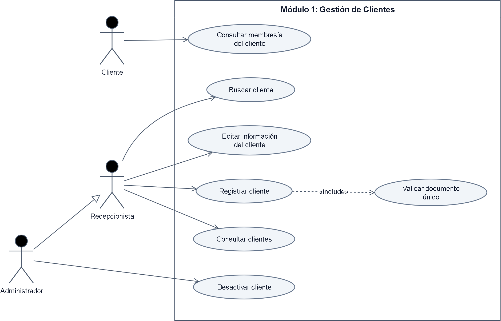

| **RF** | **Módulo** | **Descripción** |
| --- | --- | --- |
| RF-01 | Módulo 1: Gestión de Clientes | Registrar un nuevo cliente con nombre, documento y teléfono (obligatorios) y correo (opcional), validando los campos obligatorios y que el documento no exista, y confirmando el guardado. |
| RF-02 |  | Consultar el listado de clientes registrados y el detalle de un cliente seleccionado. |
| RF-03 |  | Buscar un cliente por nombre o documento, informando si no hay coincidencias. |
| RF-04 |  | Editar los datos de un cliente existente y guardar los cambios con confirmación. |
| RF-05 |  | Cambiar el estado de un cliente (activo/inactivo), con confirmación previa. Un cliente inactivo no puede iniciar sesión. |
| RF-06 |  | Consultar la membresía propia: tipo, actividades incluidas con sus límites, beneficios, estado y fecha de vencimiento. |

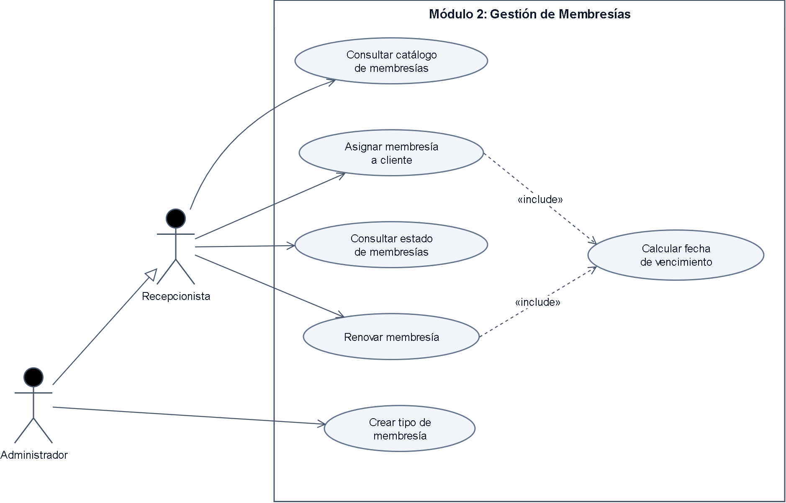

| **RF** | **Módulo** | **Descripción** |
| --- | --- | --- |
| RF-07 | Módulo 2: Gestión de Membresías | Crear tipos de membresía definiendo nombre, precio, duración y unidad de duración (días o meses). |
| RF-08 |  | Consultar el catálogo de membresías registradas con su precio, duración, actividades incluidas con sus límites y beneficios. |
| RF-09 |  | Asignar una membresía a un cliente, calculando automáticamente la fecha de vencimiento según la duración y su unidad. Si el cliente tiene una membresía activa, la nueva la reemplaza previa confirmación. |
| RF-10 |  | Consultar membresías activas, vencidas y próximas a vencer (según los días de aviso configurados), con sus fechas. |
| RF-11 |  | Renovar la membresía de un cliente registrando una nueva membresía con vigencia desde la fecha actual; la anterior queda en estado reemplazada. Requiere confirmación. |
| RF-29 |  | Gestionar el catálogo de beneficios del gimnasio: registrar, editar, activar y desactivar beneficios. |
| RF-30 |  | Configurar las actividades que incluye cada tipo de membresía, con su límite de inscripciones y el período del límite (o sin límite), y los beneficios informativos que incluye. |

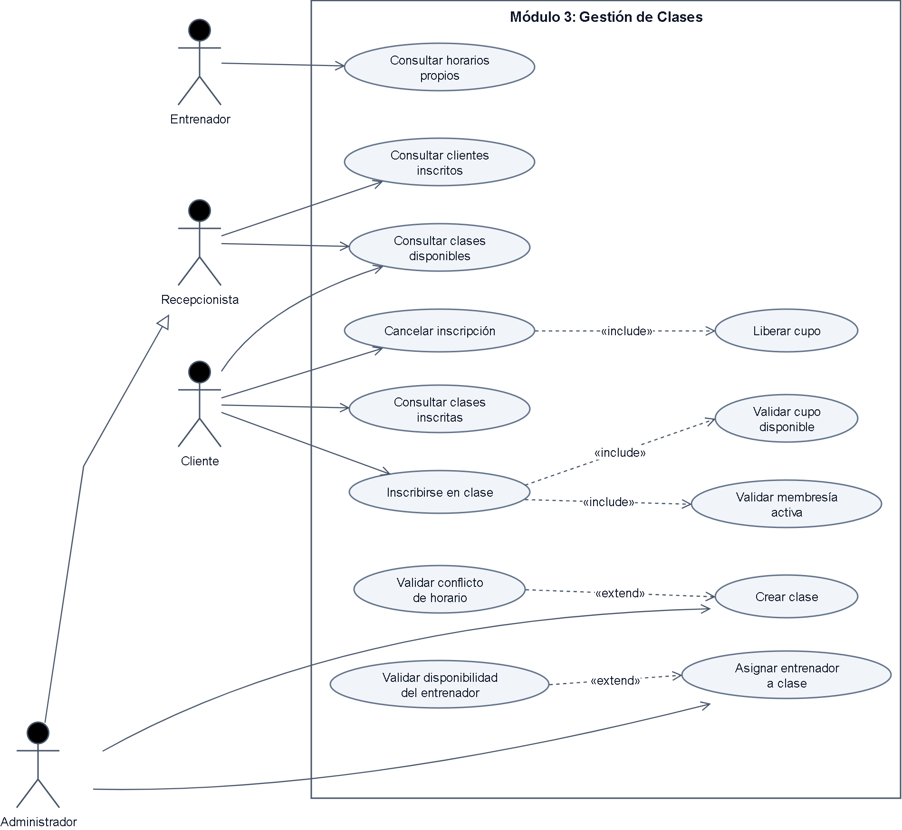

| **RF** | **Módulo** | **Descripción** |
| --- | --- | --- |
| RF-12 | Módulo 3: Gestión de Actividades | Programar una actividad definiendo la actividad, el día de la semana, la hora de inicio, la hora de fin, el espacio y el entrenador, validando que la hora de fin sea posterior a la de inicio, que no haya cruce en el espacio y que el entrenador esté activo, sin cruces de horario y dentro de su horario fijo. |
| RF-13 |  | Asignar o cambiar el entrenador de una actividad programada, validando que el entrenador esté activo, que no tenga cruces de horario y que la programación esté dentro de su horario fijo. Si el entrenador está inactivo, el sistema rechaza la asignación. |
| RF-14 |  | Consultar las actividades programadas disponibles con actividad, día, horario, espacio, cupo restante y entrenador asignado, indicando si están incluidas en la membresía del cliente y, si tienen límite, cuántas inscripciones le quedan. |
| RF-15 |  | Inscribirse en una actividad programada, validando que el cliente tenga una membresía activa cuyo tipo incluya la actividad, que no haya agotado el límite del período (si existe), que no tenga una inscripción activa en la misma programación y que exista cupo. |
| RF-16 |  | Cancelar la propia inscripción, liberando el cupo. La inscripción cancelada deja de contar para el límite del plan. |
| RF-17 |  | Consultar los clientes inscritos en una actividad programada y su cantidad total. |
| RF-18 |  | Consultar las actividades programadas y los horarios propios asignados. |
| RF-19 |  | Consultar las actividades programadas en las que el cliente está inscrito. |
| RF-31 |  | Gestionar el catálogo de actividades: registrar, editar, activar y desactivar actividades con nombre, descripción y capacidad máxima. |
| RF-32 |  | Gestionar los espacios del gimnasio: registrar y editar espacios con nombre y capacidad. |
| RF-33 |  | Cancelar una actividad programada, cancelando automáticamente sus inscripciones activas. |

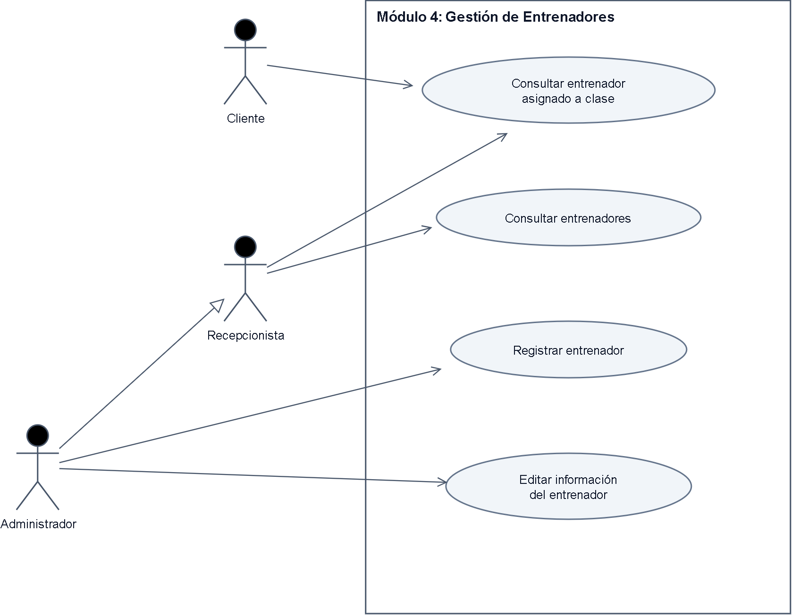

| **RF** | **Módulo** | **Descripción** |
| --- | --- | --- |
| RF-20 | Módulo 4: Gestión de Entrenadores | Registrar un entrenador con nombre, documento y teléfono (obligatorios) y correo (opcional), validando que el documento no exista. |
| RF-21 |  | Editar la información de un entrenador. |
| RF-22 |  | Consultar a los entrenadores registrados y su detalle. |
| RF-23 |  | Consultar qué entrenador está asignado a cada actividad programada. |
| RF-34 |  | Definir el horario fijo de cada entrenador (día, hora de inicio y hora de fin). |
| RF-35 |  | Cambiar el estado de un entrenador (activo/inactivo). Para desactivarlo, sus actividades programadas deben haberse reasignado previamente. |

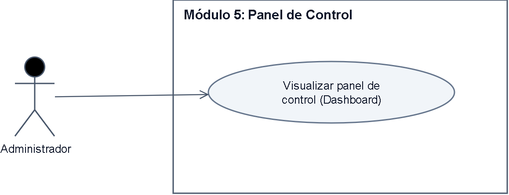

| **RF** | **Módulo** | **Descripción** |
| --- | --- | --- |
| RF-24 | Módulo 5: Panel de Control | Mostrar un panel con: clientes activos, membresías activas/vencidas, membresías próximas a vencer (según los días de aviso configurados) y actividades programadas. |
| RF-36 |  | Configurar los días de aviso con los que una membresía se considera próxima a vencer. |

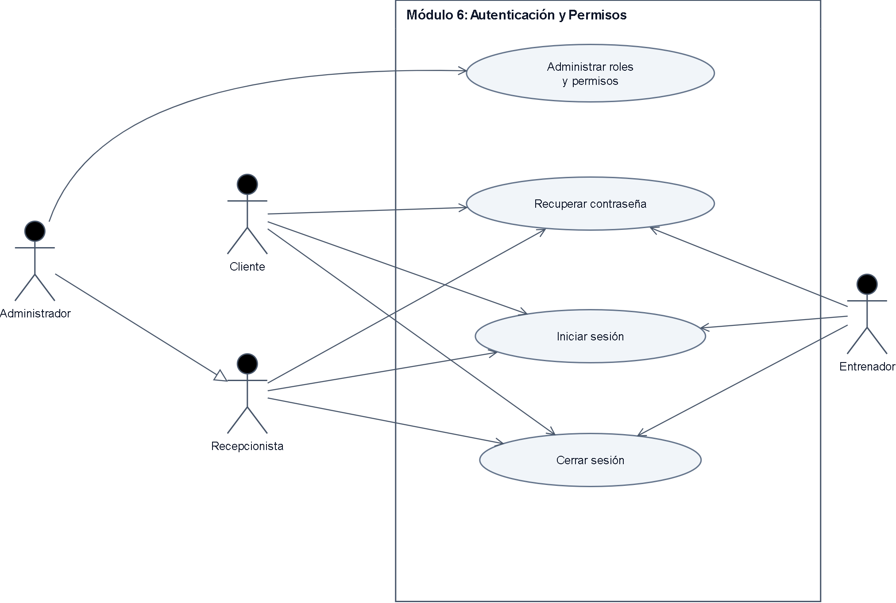

| **RF** | **Módulo** | **Descripción** |
| --- | --- | --- |
| RF-25 | Módulo 6: Autenticación y Permisos | Iniciar sesión validando usuario y contraseña de un usuario activo; mostrar solo las funciones permitidas según los permisos de su rol. |
| RF-26 |  | Cerrar sesión, bloqueando el acceso a funciones protegidas sin re-autenticación. |
| RF-27 |  | Recuperar la contraseña: el usuario solicita la recuperación, el sistema envía un código de un solo uso al teléfono o al correo registrado, y el usuario lo ingresa antes de que venza (15 minutos, máximo 3 intentos fallidos) para establecer una nueva contraseña. |
| RF-28 |  | Restringir el acceso a las funcionalidades según 4 roles fijos: Administrador, Recepcionista, Entrenador y Cliente, de acuerdo con los permisos configurados para cada rol. |
| RF-37 |  | Asignar roles a los usuarios y configurar los permisos de cada rol. |
| RF-38 |  | Crear las credenciales de acceso (nombre de usuario y contraseña) de clientes y entrenadores registrados. |
| RF-39 |  | Registrar usuarios con rol Administrador o Recepcionista, con sus datos personales y credenciales de acceso. |

# 15. Diagrama de clases:

# 16. Diagrama de secuencia:

## GESTIÓN DE CLIENTES:

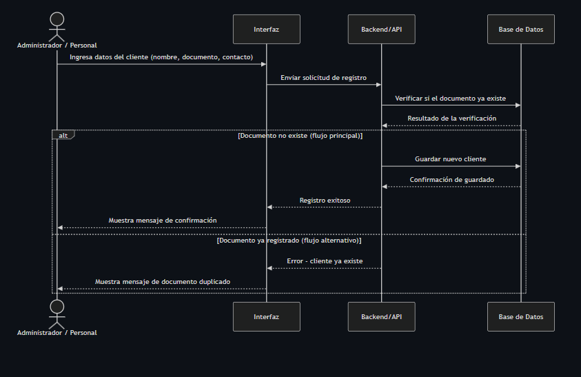

## GESTIÓN DE MEMBRESÍAS:

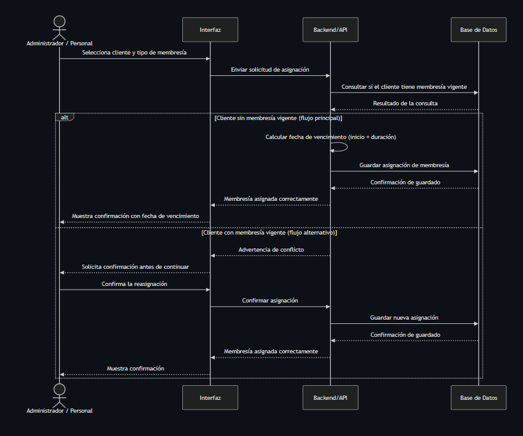

## GESTIÓN DE ACTIVIDADES:

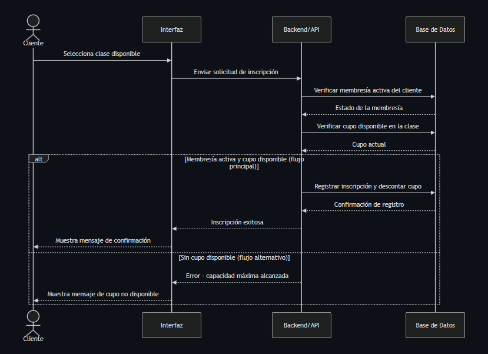

## GESTIÓN DE ENTRENADORES:

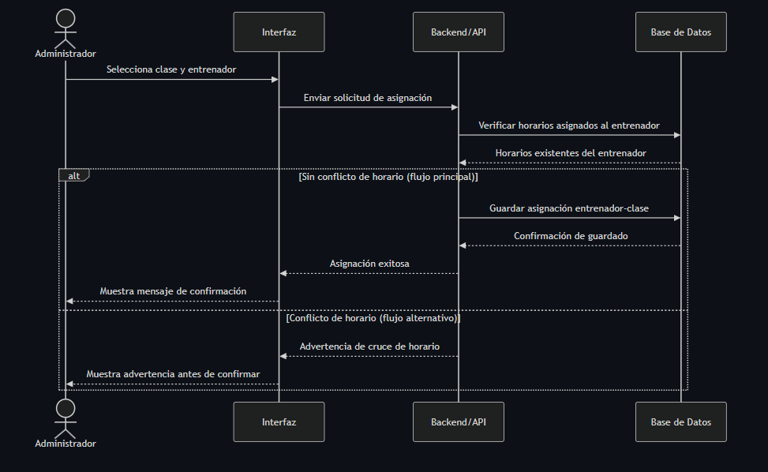

## DASHBOARD Y REPORTES:

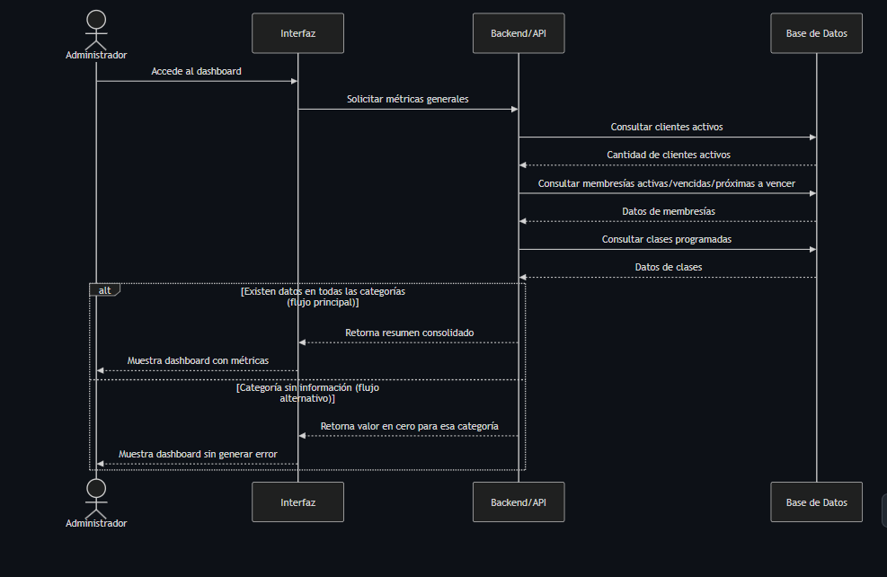

## AUTENTICACIÓN Y PERMISOS:

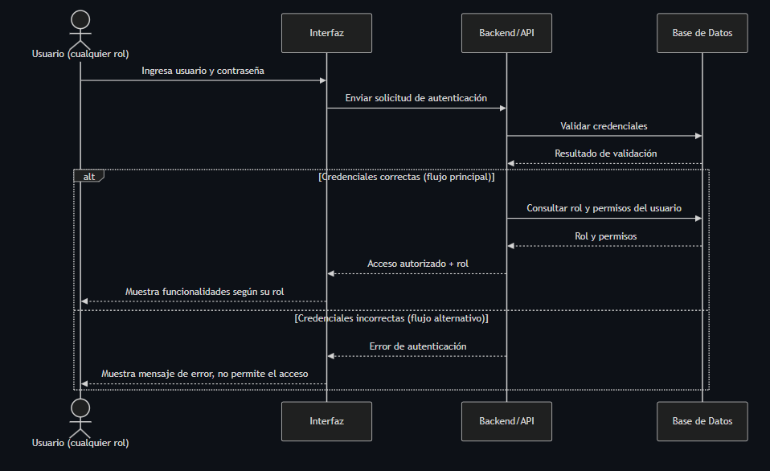

# 17. Diagrama de actividades:

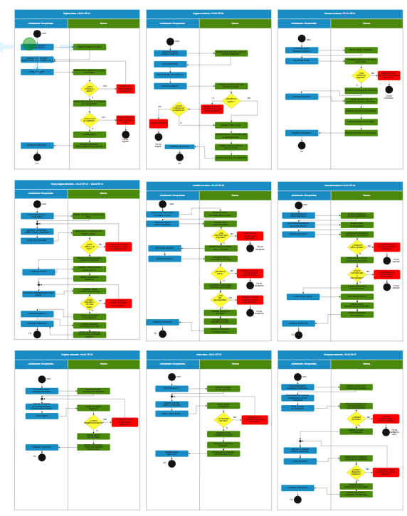

## Registrar cliente

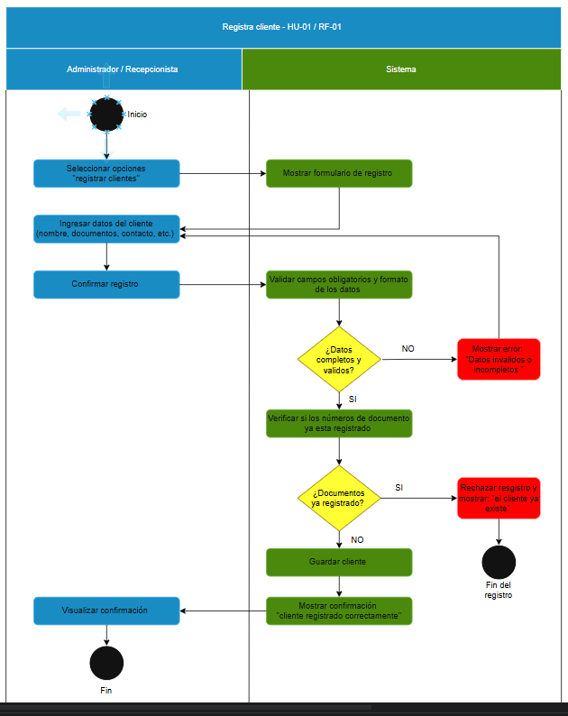

| **RF** | **Módulo** | **Descripción** |
| --- | --- | --- |
| RF-01 | Módulo 1: Gestión de Clientes | Registrar un nuevo cliente con nombre, documento y teléfono (obligatorios) y correo (opcional), validando los campos obligatorios y que el documento no exista, y confirmando el guardado. |

## Asignar membresía

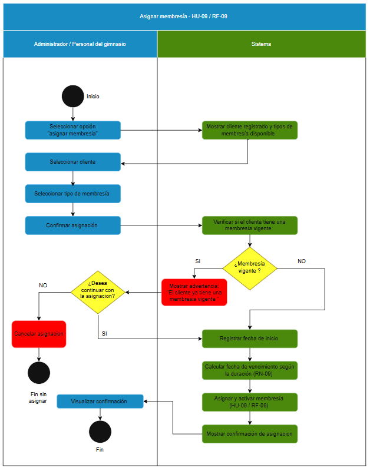

| **RF** | **Módulo** | **Descripción** |
| --- | --- | --- |
| RF-09 | Módulo 2: Gestión de Membresías | Asignar una membresía a un cliente, calculando automáticamente la fecha de vencimiento según la duración y su unidad. Si el cliente tiene una membresía activa, la nueva la reemplaza previa confirmación. |

## Renovar membresía

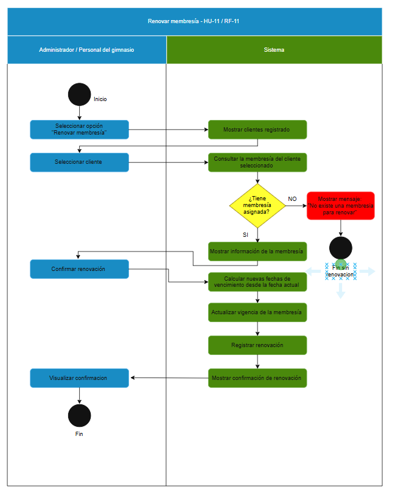

| **RF** | **Módulo** | **Descripción** |
| --- | --- | --- |
| RF-11 | Módulo 2: Gestión de Membresías | Renovar la membresía de un cliente registrando una nueva membresía con vigencia desde la fecha actual; la anterior queda en estado reemplazada. Requiere confirmación. |

## Programar actividad y asignar entrenador

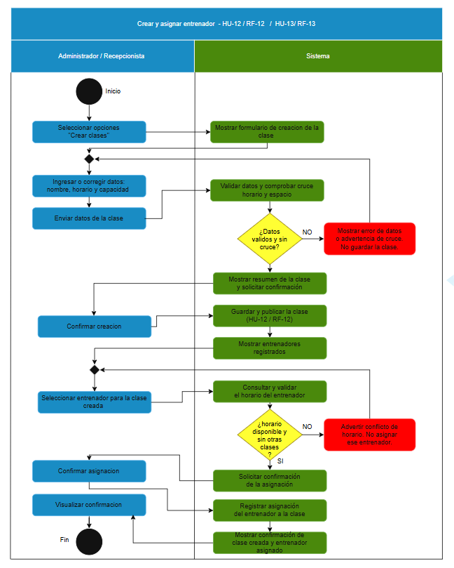

| **RF** | **Módulo** | **Descripción** |
| --- | --- | --- |
| RF-12 | Módulo 3: Gestión de Actividades | Programar una actividad definiendo la actividad, el día de la semana, la hora de inicio, la hora de fin, el espacio y el entrenador, validando que la hora de fin sea posterior a la de inicio, que no haya cruce en el espacio y que el entrenador esté activo, sin cruces de horario y dentro de su horario fijo. |
| RF-13 |  | Asignar o cambiar el entrenador de una actividad programada, validando que el entrenador esté activo, que no tenga cruces de horario y que la programación esté dentro de su horario fijo. Si el entrenador está inactivo, el sistema rechaza la asignación. |

## Inscribirse en una actividad

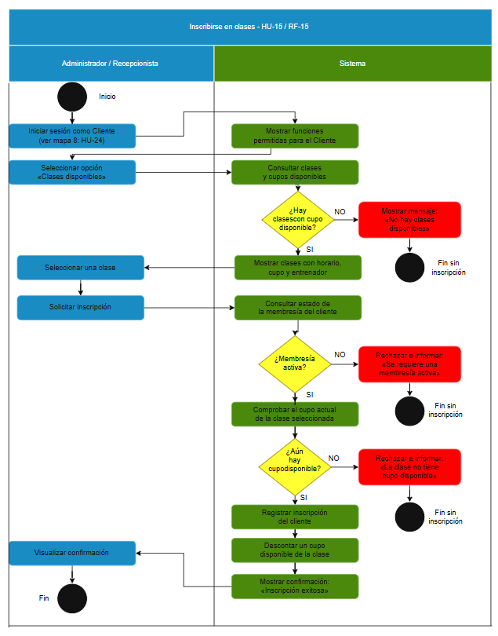

| **RF** | **Módulo** | **Descripción** |
| --- | --- | --- |
| RF-15 | Módulo 3: Gestión de Actividades | Inscribirse en una actividad programada, validando que el cliente tenga una membresía activa cuyo tipo incluya la actividad, que no haya agotado el límite del período (si existe), que no tenga una inscripción activa en la misma programación y que exista cupo. |

## Cancelar inscripción

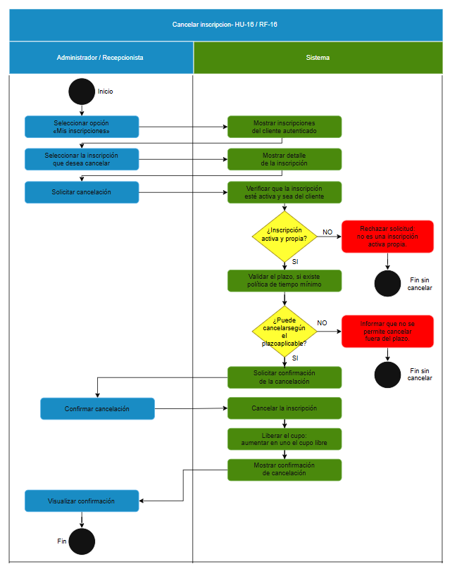

| **RF** | **Módulo** | **Descripción** |
| --- | --- | --- |
| RF-16 | Módulo 3: Gestión de Actividades | Cancelar la propia inscripción, liberando el cupo. La inscripción cancelada deja de contar para el límite del plan. |

## Registrar entrenador

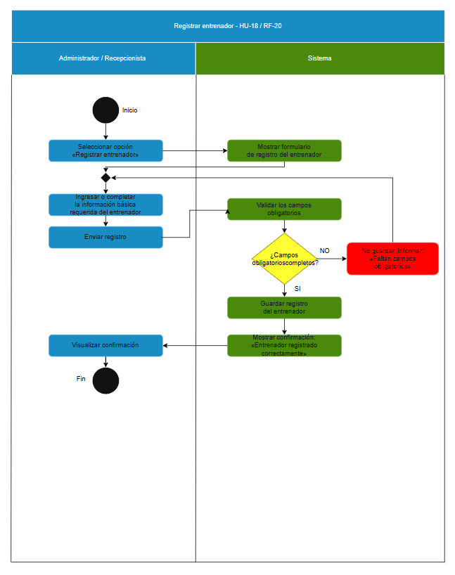

| **RF** | **Módulo** | **Descripción** |
| --- | --- | --- |
| RF-20 | Módulo 4: Gestión de Entrenadores | Registrar un entrenador con nombre, documento y teléfono (obligatorios) y correo (opcional), validando que el documento no exista. |

## Iniciar sesión

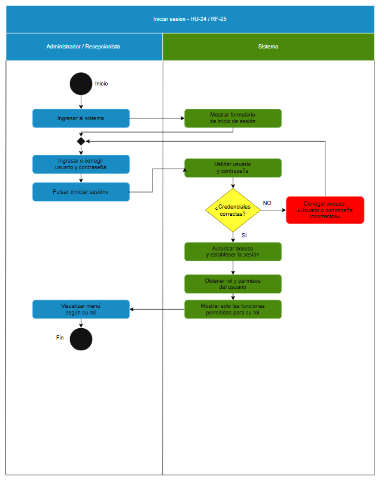

| **RF** | **Módulo** | **Descripción** |
| --- | --- | --- |
| RF-25 | Módulo 6: Autenticación y Permisos | Iniciar sesión validando usuario y contraseña de un usuario activo; mostrar solo las funciones permitidas según los permisos de su rol. |

## Recuperar contraseña

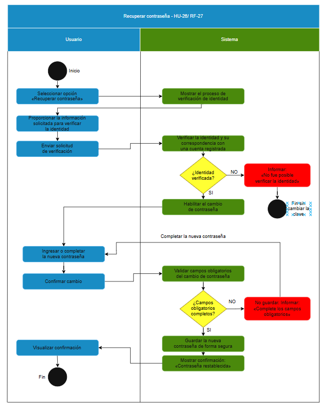

| **RF** | **Módulo** | **Descripción** |
| --- | --- | --- |
| RF-27 | Módulo 6: Autenticación y Permisos | Recuperar la contraseña: el usuario solicita la recuperación, el sistema envía un código de un solo uso al teléfono o al correo registrado, y el usuario lo ingresa antes de que venza (15 minutos, máximo 3 intentos fallidos) para establecer una nueva contraseña. |
