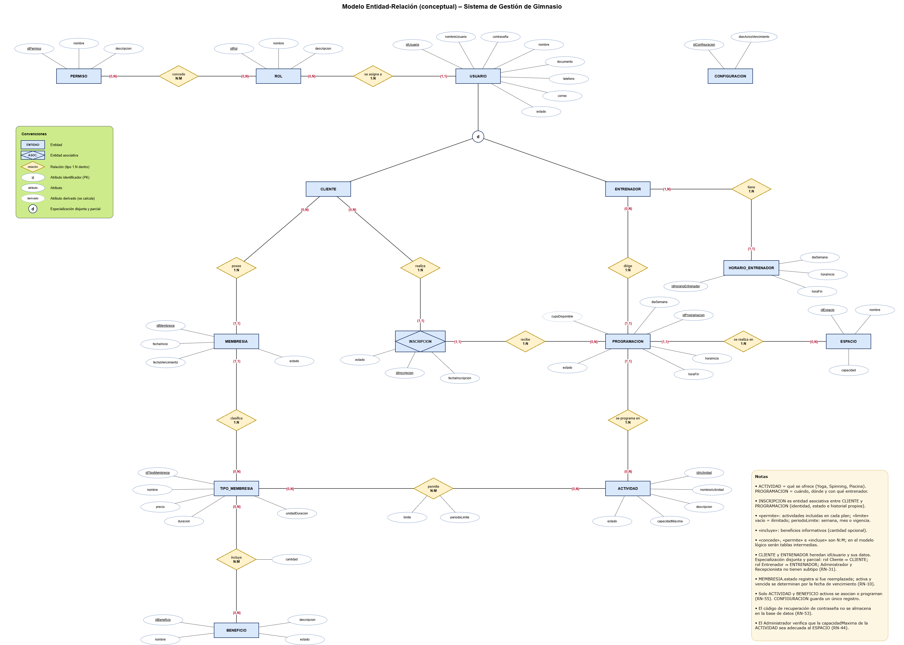

# Fase 4 — Base de datos: modelo conceptual

El modelo conceptual se construyó a partir de las épicas e historias de usuario (01), los requisitos, reglas de negocio y restricciones (02) y el modelo UML (03). El motor de base de datos definido para el proyecto es **MySQL** (RES-03).

## 18. Identificación de entidades

### 18.1. Entidades del modelo

| **Entidad** | **Tipo** | **Qué representa** | **Justificación** | **Fuente** |
| --- | --- | --- | --- | --- |
| USUARIO | Fuerte | Cuenta de acceso y datos personales de cualquier persona que usa el sistema | Todos los roles inician sesión y tienen datos personales; el documento y el nombre de usuario deben ser únicos | RF-25 a RF-28, RF-38, RF-39 · RN-02, RN-30, RN-51 |
| ROL | Fuerte | Perfil de acceso: Administrador, Recepcionista, Entrenador o Cliente | Cada usuario tiene un rol y los permisos dependen del rol | RF-28, RF-37 · RN-31, RN-32, RN-33 · RES-01 |
| PERMISO | Fuerte | Funcionalidad del sistema que puede concederse a un rol | El administrador configura los permisos de cada rol | RF-37 · RN-32, RN-33 · RNF-02 |
| CLIENTE | Especialización de USUARIO | Persona que usa los servicios del gimnasio | Tiene membresías e inscripciones propias | RF-01 a RF-06, RF-15, RF-19 · RN-01 a RN-05 |
| ENTRENADOR | Especialización de USUARIO | Persona que dirige actividades programadas | Tiene horario fijo y actividades asignadas | RF-20 a RF-23, RF-34, RF-35 · RN-22 a RN-25, RN-48 |
| HORARIO_ENTRENADOR | Débil en existencia (depende de ENTRENADOR) | Bloque de horario fijo de un entrenador (día, hora de inicio y fin) | Las programaciones deben quedar dentro del horario fijo del entrenador | RF-34 · RN-24, RN-52 |
| TIPO_MEMBRESIA | Fuerte | Plan que ofrece el gimnasio, parametrizado por el administrador | Define precio, duración, actividades incluidas y beneficios | RF-07, RF-08, RF-30 · RN-06, RN-07, RN-39 |
| BENEFICIO | Fuerte | Servicio informativo que puede incluir un plan (proteína, sauna, etc.) | El administrador gestiona un catálogo propio de beneficios | RF-29, RF-30 · RN-46, RN-47, RN-55 |
| MEMBRESIA | Fuerte | Plan asignado a un cliente, con su vigencia | Se asigna, renueva, reemplaza y consulta por cliente; guarda historial | RF-06, RF-09, RF-10, RF-11 · RN-08 a RN-12, RN-38 |
| ACTIVIDAD | Fuerte | Catálogo de actividades del gimnasio (Yoga, Spinning, Natación…) | Define qué se ofrece y su capacidad máxima; los planes incluyen actividades | RF-31 · RN-13, RN-21, RN-39, RN-55 |
| PROGRAMACION | Fuerte | Realización concreta de una actividad: día, horario, espacio y entrenador | Es lo que el cliente consulta y en lo que se inscribe | RF-12 a RF-14, RF-18, RF-23, RF-33 · RN-13 a RN-16, RN-43 |
| ESPACIO | Fuerte | Lugar del gimnasio donde se realizan las actividades | Evita cruces de programaciones en el mismo lugar | RF-32 · RN-14, RN-44 |
| INSCRIPCION | Asociativa (CLIENTE – PROGRAMACION) | Registro de un cliente en una actividad programada | Resuelve la relación N:M entre clientes y programaciones, con fecha, estado e historial propios | RF-15 a RF-17, RF-19 · RN-17 a RN-21, RN-40 a RN-42 |
| CONFIGURACION | Fuerte (registro único) | Parámetros generales del gimnasio | Guarda los días de aviso de vencimiento que define el administrador | RF-36 · RN-49, RN-54 |

### 18.2. Elementos que no son entidades

| **Elemento** | **Por qué no es una entidad** |
| --- | --- |
| Administrador y Recepcionista | Son usuarios que se distinguen por su ROL; no tienen datos propios adicionales. |
| Dashboard y reportes | Su información se calcula a partir de clientes, membresías y programaciones (RN-27); no se almacena. |
| Cupo disponible | Es un dato derivado: capacidad máxima de la actividad menos inscripciones activas (RN-45). |
| Estado "próxima a vencer" | Es una clasificación calculada con la fecha de vencimiento y los días de aviso (RN-10). |
| Código de recuperación de contraseña | No se almacena en la base de datos; el servidor lo conserva temporalmente (RN-53, RES-12). |
| Sesión de usuario | El inicio y cierre de sesión no requieren persistencia en el modelo. |

## 19. Definición de atributos

Tipos de dato conceptuales: **Entero**, **Decimal**, **Texto**, **Fecha**, **Hora** y **Lista de valores** (texto restringido a valores definidos). Los tipos físicos de MySQL se definen en el modelo lógico.

### 19.1. USUARIO

| **Atributo** | **Descripción** | **Tipo** | **Obligatorio** | **Observación** |
| --- | --- | --- | --- | --- |
| idUsuario | Identificador del usuario | Entero | Sí | Clave primaria |
| nombreUsuario | Nombre para iniciar sesión | Texto | Sí | Único (RN-51) |
| contraseña | Credencial de acceso | Texto | Sí | Se almacena mediante un hash seguro de contraseña, nunca en texto plano ni con cifrado reversible (RNF-01) |
| nombre | Nombre completo | Texto | Sí | RN-01, RN-23 |
| documento | Número de documento | Texto | Sí | Único entre todos los usuarios (RN-02) |
| telefono | Teléfono de contacto | Texto | Sí | También se usa para recuperar la contraseña (RF-27) |
| correo | Correo electrónico | Texto | No | Opcional (RN-01, RN-23); si está registrado, también puede usarse para recuperar la contraseña (RF-27) |
| estado | Estado de la cuenta | Lista de valores | Sí | Activo / Inactivo. Un usuario inactivo no puede iniciar sesión (RN-05, RN-48) |

### 19.2. ROL

| **Atributo** | **Descripción** | **Tipo** | **Obligatorio** | **Observación** |
| --- | --- | --- | --- | --- |
| idRol | Identificador del rol | Entero | Sí | Clave primaria |
| nombre | Nombre del rol | Lista de valores | Sí | Administrador, Recepcionista, Entrenador o Cliente (RN-31). Único |
| descripcion | Descripción del rol | Texto | No | Informativo |

### 19.3. PERMISO

| **Atributo** | **Descripción** | **Tipo** | **Obligatorio** | **Observación** |
| --- | --- | --- | --- | --- |
| idPermiso | Identificador del permiso | Entero | Sí | Clave primaria |
| nombre | Nombre de la funcionalidad que habilita | Texto | Sí | Único |
| descripcion | Descripción del permiso | Texto | No | Informativo |

### 19.4. CLIENTE y ENTRENADOR

Son especializaciones de USUARIO: heredan su identificador y sus atributos. No tienen atributos propios; existen como entidades porque participan en relaciones exclusivas (el cliente posee membresías y realiza inscripciones; el entrenador tiene horario fijo y dirige programaciones).

| **Entidad** | **Atributo** | **Descripción** | **Tipo** | **Obligatorio** | **Observación** |
| --- | --- | --- | --- | --- | --- |
| CLIENTE | idUsuario | Identificador heredado de USUARIO | Entero | Sí | Clave primaria y referencia a USUARIO |
| ENTRENADOR | idUsuario | Identificador heredado de USUARIO | Entero | Sí | Clave primaria y referencia a USUARIO |

### 19.5. HORARIO_ENTRENADOR

| **Atributo** | **Descripción** | **Tipo** | **Obligatorio** | **Observación** |
| --- | --- | --- | --- | --- |
| idHorarioEntrenador | Identificador del bloque de horario | Entero | Sí | Clave primaria |
| diaSemana | Día de la semana | Lista de valores | Sí | Lunes a domingo |
| horaInicio | Hora de inicio | Hora | Sí | — |
| horaFin | Hora de fin | Hora | Sí | Posterior a horaInicio (RN-52) |

### 19.6. TIPO_MEMBRESIA

| **Atributo** | **Descripción** | **Tipo** | **Obligatorio** | **Observación** |
| --- | --- | --- | --- | --- |
| idTipoMembresia | Identificador del tipo de membresía | Entero | Sí | Clave primaria |
| nombre | Nombre del plan | Texto | Sí | Único (RN-07) |
| precio | Precio del plan | Decimal | Sí | Informativo; el sistema no gestiona pagos (RN-06) |
| duracion | Cantidad de tiempo de vigencia | Entero | Sí | Mayor que cero (RN-06) |
| unidadDuracion | Unidad de la duración | Lista de valores | Sí | Días o meses (RN-06) |

### 19.7. BENEFICIO

| **Atributo** | **Descripción** | **Tipo** | **Obligatorio** | **Observación** |
| --- | --- | --- | --- | --- |
| idBeneficio | Identificador del beneficio | Entero | Sí | Clave primaria |
| nombre | Nombre del beneficio | Texto | Sí | Único (RN-47) |
| descripcion | Descripción del beneficio | Texto | No | Informativo |
| estado | Estado del beneficio | Lista de valores | Sí | Activo / Inactivo (RN-55) |

### 19.8. MEMBRESIA

| **Atributo** | **Descripción** | **Tipo** | **Obligatorio** | **Observación** |
| --- | --- | --- | --- | --- |
| idMembresia | Identificador de la membresía | Entero | Sí | Clave primaria |
| fechaInicio | Fecha de inicio de la vigencia | Fecha | Sí | En una renovación, es la fecha actual (RF-11) |
| fechaVencimiento | Fecha de fin de la vigencia | Fecha | Sí | Se calcula al registrar: fechaInicio + duración según su unidad (RN-09) |
| estado | Estado formal de la membresía | Lista de valores | Sí | Registra si la membresía fue reemplazada. Activa y vencida se determinan con la fecha de vencimiento; una membresía reemplazada no vuelve a clasificarse como activa ni vencida (RN-10) |

### 19.9. ACTIVIDAD

| **Atributo** | **Descripción** | **Tipo** | **Obligatorio** | **Observación** |
| --- | --- | --- | --- | --- |
| idActividad | Identificador de la actividad | Entero | Sí | Clave primaria |
| nombreActividad | Nombre de la actividad | Texto | Sí | RN-13 |
| descripcion | Descripción de la actividad | Texto | Sí | CA-31 |
| capacidadMaxima | Cupos por cada programación | Entero | Sí | Mayor que cero. Prevalece para calcular el cupo (RN-45) |
| estado | Estado de la actividad | Lista de valores | Sí | Activa / Inactiva (RN-55) |

### 19.10. PROGRAMACION

| **Atributo** | **Descripción** | **Tipo** | **Obligatorio** | **Observación** |
| --- | --- | --- | --- | --- |
| idProgramacion | Identificador de la programación | Entero | Sí | Clave primaria |
| diaSemana | Día en que se realiza | Lista de valores | Sí | Lunes a domingo |
| horaInicio | Hora de inicio | Hora | Sí | — |
| horaFin | Hora de fin | Hora | Sí | Posterior a horaInicio (RN-52) |
| estado | Estado de la programación | Lista de valores | Sí | Programada / Cancelada (RN-43) |
| cupoDisponible | Cupos libres | Entero | — | **Derivado, no se almacena**: capacidadMaxima de la actividad menos inscripciones activas (RN-45) |

### 19.11. ESPACIO

| **Atributo** | **Descripción** | **Tipo** | **Obligatorio** | **Observación** |
| --- | --- | --- | --- | --- |
| idEspacio | Identificador del espacio | Entero | Sí | Clave primaria |
| nombre | Nombre del espacio | Texto | Sí | — |
| capacidad | Capacidad del espacio | Entero | Sí | Informativa; el administrador verifica que sea adecuada a la actividad (RN-44) |

### 19.12. INSCRIPCION

| **Atributo** | **Descripción** | **Tipo** | **Obligatorio** | **Observación** |
| --- | --- | --- | --- | --- |
| idInscripcion | Identificador de la inscripción | Entero | Sí | Clave primaria |
| fechaInscripcion | Fecha en que se registró | Fecha | Sí | Permite contar inscripciones por período (RN-40) |
| estado | Estado de la inscripción | Lista de valores | Sí | Activa / Cancelada. Las canceladas no cuentan para el límite ni el cupo (RN-20, RN-40) |

### 19.13. CONFIGURACION

| **Atributo** | **Descripción** | **Tipo** | **Obligatorio** | **Observación** |
| --- | --- | --- | --- | --- |
| idConfiguracion | Identificador del registro | Entero | Sí | Clave primaria. Existe un único registro |
| diasAvisoVencimiento | Días de anticipación para clasificar una membresía como próxima a vencer | Entero | Sí | Mínimo 1 (RN-49, RN-54) |

### 19.14. Atributos de las relaciones N:M

| **Relación** | **Atributo** | **Descripción** | **Tipo** | **Obligatorio** | **Observación** |
| --- | --- | --- | --- | --- | --- |
| permite (TIPO_MEMBRESIA – ACTIVIDAD) | limite | Número máximo de inscripciones en el período | Entero | No | Vacío = actividad ilimitada (RN-39) |
| permite (TIPO_MEMBRESIA – ACTIVIDAD) | periodoLimite | Período en que se cuenta el límite | Lista de valores | Solo si hay límite | Semana, mes o vigencia de la membresía (RN-39) |
| incluye (TIPO_MEMBRESIA – BENEFICIO) | cantidad | Cantidad informativa del beneficio | Texto | No | Solo se muestra; el sistema no controla su uso (RN-46) |
| concede (ROL – PERMISO) | — | — | — | — | Sin atributos propios |

## 20. Definición de claves primarias

Todas las entidades usan un identificador artificial como clave primaria, porque los identificadores naturales disponibles pueden editarse (RF-04, RF-21) o son textos. Los datos que deben ser únicos se registran como **claves candidatas**.

| **Entidad** | **Clave primaria** | **Claves candidatas (únicas)** | **Justificación** |
| --- | --- | --- | --- |
| USUARIO | idUsuario | documento (RN-02), nombreUsuario (RN-51) | El documento y el nombre de usuario son únicos, pero editables |
| ROL | idRol | nombre | Los cuatro roles son fijos (RN-31) |
| PERMISO | idPermiso | nombre | — |
| CLIENTE | idUsuario | — | Clave heredada de USUARIO por la especialización |
| ENTRENADOR | idUsuario | — | Clave heredada de USUARIO por la especialización |
| HORARIO_ENTRENADOR | idHorarioEntrenador | — | Un entrenador puede tener varios bloques el mismo día |
| TIPO_MEMBRESIA | idTipoMembresia | nombre (RN-07) | El nombre es editable |
| BENEFICIO | idBeneficio | nombre (RN-47) | El nombre es editable |
| MEMBRESIA | idMembresia | — | Un cliente acumula varias membresías en su historial |
| ACTIVIDAD | idActividad | — | No hay identificador natural |
| PROGRAMACION | idProgramacion | — | Puede haber varias programaciones de la misma actividad |
| ESPACIO | idEspacio | — | No hay identificador natural |
| INSCRIPCION | idInscripcion | — | Un cliente puede volver a inscribirse en la misma programación después de cancelar (RN-42), por lo que la pareja cliente–programación no es única |
| CONFIGURACION | idConfiguracion | — | Registro único |

## 21. Definición de relaciones

La participación se expresa como **(mínimo, máximo)** de cada entidad en la relación.

| **Entidad A** | **Relación** | **Entidad B** | **Cardinalidad** | **Participación** | **Justificación** |
| --- | --- | --- | --- | --- | --- |
| ROL | se asigna a | USUARIO | 1:N | Rol (0,N) · Usuario (1,1) | Cada usuario tiene exactamente un rol (RN-31) |
| ROL | concede | PERMISO | N:M | Rol (0,N) · Permiso (0,N) | Un rol tiene varios permisos y un permiso puede estar en varios roles (RF-37, RN-32) |
| ENTRENADOR | tiene | HORARIO_ENTRENADOR | 1:N | Entrenador (1,N) · Horario (1,1) | Todo entrenador tiene horario fijo (RN-24) |
| CLIENTE | posee | MEMBRESIA | 1:N | Cliente (0,N) · Membresía (1,1) | Historial de membresías; máximo una activa (RN-08, RN-38) |
| TIPO_MEMBRESIA | clasifica | MEMBRESIA | 1:N | Tipo (0,N) · Membresía (1,1) | Toda membresía es de un tipo (RES-07) |
| TIPO_MEMBRESIA | permite | ACTIVIDAD | N:M | Tipo (0,N) · Actividad (0,N) | Actividades incluidas en cada plan, con límite y período (RN-21, RN-39) |
| TIPO_MEMBRESIA | incluye | BENEFICIO | N:M | Tipo (0,N) · Beneficio (0,N) | Beneficios informativos de cada plan (RN-46) |
| ACTIVIDAD | se programa en | PROGRAMACION | 1:N | Actividad (0,N) · Programación (1,1) | Toda programación es de una actividad (RN-13) |
| ESPACIO | se realiza en | PROGRAMACION | 1:N | Espacio (0,N) · Programación (1,1) | Toda programación ocurre en un espacio (RN-13, RN-14) |
| ENTRENADOR | dirige | PROGRAMACION | 1:N | Entrenador (0,N) · Programación (1,1) | Toda programación tiene un entrenador activo (RN-15, RN-16) |
| CLIENTE | realiza | INSCRIPCION | 1:N | Cliente (0,N) · Inscripción (1,1) | Un cliente se inscribe en varias programaciones (RF-15, RF-19) |
| PROGRAMACION | recibe | INSCRIPCION | 1:N | Programación (0,N) · Inscripción (1,1) | Las inscripciones activas no superan la capacidad (RN-18) |

**Especialización de USUARIO.** USUARIO se especializa en CLIENTE y ENTRENADOR de forma **disjunta** (un usuario no puede ser cliente y entrenador a la vez, porque tiene un solo rol, RN-31) y **parcial** (los usuarios con rol Administrador o Recepcionista no se especializan).

**Restricción de correspondencia entre rol y subtipo.** El subtipo de cada usuario depende de su rol (RN-31):

- Un usuario con rol **Cliente** debe tener su registro en CLIENTE, y solo él puede tenerlo.
- Un usuario con rol **Entrenador** debe tener su registro en ENTRENADOR, y solo él puede tenerlo.
- Un usuario con rol **Administrador** o **Recepcionista** no tiene registro en ninguno de los dos subtipos.

Esta regla no se puede expresar solo con la notación de la especialización. Se deberá garantizar en el modelo lógico o en la capa de servicio al crear un usuario y asignarle su rol.

**Relación N:M entre CLIENTE y PROGRAMACION.** Un cliente puede inscribirse en muchas programaciones y una programación recibe muchos clientes. Se resuelve con la entidad asociativa INSCRIPCION porque cada inscripción tiene identidad, fecha y estado propios y debe conservarse en el historial.

**Relaciones N:M sin entidad propia.** «concede», «permite» e «incluye» se representan como relaciones (las dos últimas con atributos). En el modelo lógico se convertirán en tablas intermedias.

## 22. Modelo entidad-relación

Archivo editable: [08_Modelo_Entidad_Relacion.drawio](media/diagrams/08_Diagrama_modelo_ER.drawio)

**Notación:** Chen. Rectángulo = entidad; rectángulo con rombo = entidad asociativa; rombo = relación (con su tipo 1:N o N:M); óvalo = atributo; óvalo con texto subrayado = clave primaria; óvalo punteado = atributo derivado; círculo con "d" = especialización disjunta; la línea simple desde USUARIO indica que es parcial. Los valores (mínimo, máximo) junto a cada entidad indican su participación.